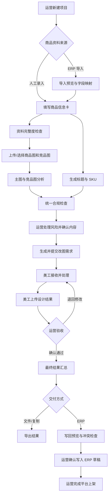

# AI 电商运营助手系统——产品需求文档（PRD）

> 文档版本：V0.1  
> 文档状态：需求讨论稿  
> 当前阶段：需求规划，不进入原型和开发  
> 首要业务场景：拼多多商品运营  
> 角色范围：电商运营、美工、管理员

---

## 0. 文档说明

### 0.1 文档目的

本文档用于确认 AI 电商运营助手系统第一阶段的产品目标、用户角色、业务流程、功能需求、权限、状态、业务规则和验收标准。

需求确认后，再依次制作：

1. 商品信息字段字典。
2. ERP 字段映射模板。
3. 详细业务流程图。
4. 页面信息架构与低保真原型。
5. 接口和数据库设计。
6. 开发任务拆分。

### 0.2 标记说明

- **MVP**：第一版必须实现。
- **P1**：MVP 稳定后优先增加。
- **P2**：远期规划。
- **【待确认】**：需要结合实际运营流程继续确定。
- **【建议】**：当前推荐方案，可以修改。

### 0.3 版本记录

| 版本 | 日期 | 修改内容 | 状态 |
|---|---|---|---|
| V0.1 | 2026-07-26 | 完成首版需求框架，确认运营、美工、管理员三类角色 | 讨论稿 |
| V0.2 | 【待填写】 | 【待填写】 | 【待填写】 |

---

## 1. 项目背景

### 1.1 当前工作方式

电商运营在处理商品上架和优化时，需要在 ERP、平台后台、表格、图片文件夹、聊天记录和不同 AI 工具之间反复切换，主要工作包括：

- 整理商品名称、材质、规格、卖点和价格等资料。
- 编写或修改商品标题。
- 整理 SKU 规格和展示文案。
- 分析商品主图与竞品图。
- 检查极限词、夸大表述和商品信息冲突。
- 将运营想法整理成美工能够执行的改图要求。
- 接收美工结果并进行验收。
- 将最终内容录入 ERP 或平台后台并完成上架。
- 保存有效 Prompt、优秀案例和历史方案。

### 1.2 主要问题

1. 商品资料分散，同一商品在不同环节出现的信息不一致。
2. 每次使用 AI 都需要重新整理上下文，Prompt 和优秀结果难以复用。
3. 标题、SKU、图片文案和美工需求存在大量重复劳动。
4. 图片分析依赖个人经验，结论缺少固定结构。
5. 违规表达通常在上架前或平台审核时才被发现，返工成本高。
6. 运营与美工之间容易出现需求不具体、遗漏和反复沟通。
7. ERP 数据、AI 建议和人工修改之间缺少清楚的来源及版本记录。

### 1.3 产品机会

建立一个以商品项目为中心的 AI 运营工作台，将商品资料、图片、标题、SKU、合规、美工协作、ERP 对接和知识沉淀连接起来，让运营人员在同一流程中完成商品上架前的主要准备工作。

---

## 2. 产品目标与边界

### 2.1 产品目标

- 建立统一商品信息卡，作为全部业务模块的事实来源。
- 降低标题、SKU、图片分析和改图需求单的重复劳动。
- 在商品上架前发现明显的合规风险和信息冲突。
- 提高运营向美工传达需求的完整度和可执行性。
- 保存 AI 输入、输出、人工修改和最终版本，形成可复用的知识资产。
- 为妙手或其他 ERP 预留标准接入方式，减少重复录入。

### 2.2 目标结果

一个运营人员应能在一个商品项目中完成：

1. 人工建立商品，或从 ERP 导入商品。
2. 补充商品信息卡并确认资料完整度。
3. 上传和整理商品图、主图、竞品图。
4. 获得结构化图片分析。
5. 生成、编辑和确认标题及 SKU 文案。
6. 完成合规检查。
7. 生成改图需求并提交给美工。
8. 接收美工结果并由运营验收。
9. 汇总最终结果，导出或写回 ERP 草稿区。
10. 由运营在 ERP 或平台后台完成最终上架。

### 2.3 首版边界

首版不包含：

- AI 自动发布商品。
- 未经运营确认的 ERP 写回。
- 自动抓取竞品页面。
- 完整订单、采购、仓储、客服和财务管理。
- AI 自动生成或直接修改商品图片。
- 复杂企业审批流程。
- 店铺负责人或独立业务审核人角色。

### 2.4 核心原则

- AI 生成内容默认处于“待运营确认”状态。
- 运营拥有业务最终确认权，不需要额外负责人审批。
- 美工只负责设计任务执行和结果提交，不负责商品上架决策。
- 管理员负责系统能力和权限，不默认参与业务内容审核。
- ERP 默认只写回草稿或待发布区，最终上架仍由运营执行。
- 商品事实、AI 建议和人工修改必须明确区分来源。

---

## 3. 用户角色与权限

### 3.1 角色一：电商运营

#### 角色目标

完成商品资料整理、内容生成、合规检查、美工协作、结果确认和上架准备。

#### 主要权限

- 新建、编辑、归档商品项目。
- 从 ERP 导入商品和刷新商品资料。
- 编辑商品信息卡。
- 上传和管理商品图、主图、竞品图。
- 发起图片分析、标题生成和 SKU 生成。
- 编辑 AI 结果并确认最终版本。
- 处理或确认合规风险。
- 创建、修改并提交美工任务。
- 验收美工结果，要求返工或确认通过。
- 汇总和导出最终结果。
- 发起 ERP 写回预览和确认写回。
- 将优秀结果保存到知识库。

#### 权限限制

- 不能查看或修改完整 ERP 密钥。
- 不能修改全局用户权限。
- 默认不能修改系统级 Prompt 和全局合规规则；可提交优化建议。

### 3.2 角色二：美工

#### 角色目标

清楚接收改图任务、查看素材和要求、提交设计结果，并与运营围绕具体需求进行反馈。

#### 主要权限

- 查看分配给自己的美工任务。
- 查看任务关联的商品摘要、原图、参考图、文案和验收标准。
- 标记任务为已查看、处理中、待补充、已提交。
- 针对具体需求项提出问题或备注。
- 上传一版或多版改图结果。
- 说明修改内容和仍存在的问题。

#### 权限限制

- 不能修改商品信息卡的事实字段。
- 不能确认标题、SKU 和合规结果。
- 不能连接、刷新或写回 ERP。
- 不能查看商品成本、ERP 密钥、系统日志和全局设置。
- 不能将设计结果直接标记为商品最终上架版本；必须由运营验收。

### 3.3 角色三：管理员

#### 角色目标

维护系统用户、角色、Prompt、合规规则、ERP 连接和系统运行配置。

#### 主要权限

- 创建、停用用户并分配角色。
- 管理全局 Prompt 模板及版本。
- 管理平台规则、类目规则和合规词库。
- 创建和维护 ERP 连接、授权范围及字段映射。
- 查看同步、任务和系统错误日志。
- 管理数据保留、模型和系统默认参数。

#### 权限限制

- 管理员不因为拥有系统权限就自动获得业务最终确认权。
- 如果管理员也需要做运营工作，应同时分配“电商运营”角色。
- 管理员不能绕过运营确认直接将 AI 内容写回 ERP 或上架。

### 3.4 角色组合规则

- 同一个用户可以同时拥有多个角色。
- 小团队首版可由一个人同时拥有“运营 + 管理员”角色。
- 美工如同时负责运营，需要额外获得运营角色，不能通过美工权限间接操作商品。

### 3.5 角色与模块权限矩阵

| 模块 | 电商运营 | 美工 | 管理员 |
|---|---|---|---|
| 工作台与项目 | 新建、编辑、归档 | 仅查看任务关联项目摘要 | 查看，必要时维护 |
| 商品信息卡 | 编辑、确认 | 只读必要字段 | 查看，不默认修改业务内容 |
| ERP 集成 | 导入、刷新、写回确认 | 无权限 | 配置连接、字段映射、查看日志 |
| 图片素材 | 上传、分类、删除 | 查看任务素材、上传改图结果 | 查看和处理异常 |
| 图片分析 | 发起、编辑、确认 | 查看与任务相关结论 | 管理模板 |
| 标题与 SKU | 生成、编辑、确认 | 只读最终任务文案 | 管理模板和规则 |
| 合规检查 | 发起、处理风险 | 查看与设计相关风险 | 管理规则库 |
| 美工任务 | 创建、分配、验收 | 接收、反馈、提交 | 查看和处理权限问题 |
| Prompt 知识库 | 查看、使用、提交案例 | 查看相关设计规范 | 新建、修改、发布、停用 |
| 历史与版本 | 查看业务历史、恢复内容 | 查看任务版本 | 查看系统审计 |
| 结果导出 | 导出、写回预览 | 下载任务附件 | 配置导出规则 |
| 系统设置 | 个人默认项 | 个人默认项 | 全部系统设置 |

---

## 4. 整体业务流程

### 4.1 主流程

### 4.2 人工确认节点

以下节点必须由运营确认：

- 商品信息卡中的关键事实。
- 最终标题。
- 最终 SKU 展示文案。
- 中高风险合规问题的处理结果。
- 提交给美工的正式需求单。
- 美工结果是否通过验收。
- ERP 写回预览及写回动作。

### 4.3 不需要额外审批的节点

- 系统不设置店铺负责人审批流程。
- 运营确认后即可进入下一步。
- 管理员只在权限、规则、ERP 连接或系统错误层面介入。

---

## 5. 产品信息架构

### 5.1 运营端导航

1. 工作台
2. 商品项目
3. 我的美工任务
4. Prompt 与知识库
5. 结果与导出记录
6. 个人设置

### 5.2 美工端导航

1. 我的任务
2. 处理中
3. 待补充
4. 已提交
5. 已完成
6. 设计规范/知识库

### 5.3 管理端导航

1. 用户与角色
2. Prompt 模板
3. 合规规则
4. ERP 集成
5. 系统任务与日志
6. 系统设置

### 5.4 商品项目内部结构

商品项目建议使用以下页签：

1. 项目概览
2. 商品信息卡
3. 图片素材
4. 图片与竞品分析
5. 标题与 SKU
6. 合规检查
7. 美工任务
8. 最终结果
9. 历史版本

---

## 6. 功能范围总览

| 模块编号 | 模块名称 | MVP | P1 | P2 |
|---|---|---|---|---|
| M01 | 账号与用户 | 基础账号和角色 | 多人邀请、精细权限 | 企业登录 |
| M02 | 工作台与项目 | 项目全流程 | 批量复制、模板项目 | 跨店铺管理 |
| M03 | 商品信息卡 | 人工录入、完整度 | ERP 刷新、差异比较 | 类目动态字段 |
| M04 | ERP 集成 | 接口与数据结构预留 | 首家 ERP 导入与草稿写回 | 增量同步、更多 ERP |
| M05 | 图片素材 | 上传、分类、预览 | ERP 图片导入、重复检测 | 素材资产库 |
| M06 | 图片分析 | 单图/多图/竞品分析 | 区域标注、分析对比 | 自动评测体系 |
| M07 | 标题优化 | 生成、编辑、合规、确认 | 对比评分、批量生成 | 数据驱动优化 |
| M08 | SKU 文案 | 批量生成、冲突检查 | ERP 写回 | 批量商品处理 |
| M09 | 合规检查 | 词库、语义、一致性 | 自定义规则、规则导入 | 自动规则更新 |
| M10 | 改图需求单 | 生成、编辑、提交 | 模板、批量任务 | 外部协作接入 |
| M11 | AI 任务 | 状态、重试、结果保存 | 成本统计、任务取消 | 调度优化 |
| M12 | Prompt 知识库 | 模板、版本、案例 | 测试与评分 | 自动推荐 |
| M13 | 历史与版本 | 时间线、最终版 | 对比、恢复 | 高级审计 |
| M14 | 结果与导出 | 复制、Markdown | Excel、Word、PDF | 自定义报告 |
| M15 | 规则与设置 | 基础平台/合规设置 | 完整管理后台 | 多组织策略 |
| M16 | 数据看板 | 预留数据埋点 | 效率、采用率、风险 | 经营分析 |

---

## 7. 详细功能需求

## 7.1 M01 账号与用户

### 需求说明

系统需要识别电商运营、美工和管理员，并根据角色显示对应页面和操作权限。

### 功能需求

| 需求编号 | 需求描述 | 优先级 |
|---|---|---|
| REQ-M01-01 | 用户可以登录、退出并查看自己的角色 | MVP |
| REQ-M01-02 | 管理员可以创建、停用用户并分配一个或多个角色 | MVP |
| REQ-M01-03 | 系统根据角色隐藏无权限导航和按钮 | MVP |
| REQ-M01-04 | 无权限用户直接访问页面时，系统拒绝访问并说明原因 | MVP |
| REQ-M01-05 | 重要操作记录用户、角色、时间和结果 | MVP |

### 验收标准

- 美工无法访问 ERP、商品最终确认和管理员页面。
- 运营无法查看完整 ERP 密钥或修改全局权限。
- 管理员如未获得运营角色，不能替运营确认商品结果。

---

## 7.2 M02 工作台与项目管理

### 需求说明

以商品项目作为业务容器，集中保存商品资料、图片、AI 结果、美工任务和 ERP 关联。

### 功能需求

| 需求编号 | 需求描述 | 优先级 |
|---|---|---|
| REQ-M02-01 | 运营可以人工新建商品项目 | MVP |
| REQ-M02-02 | 新建时填写项目名、平台、店铺、类目和商品来源 | MVP |
| REQ-M02-03 | 工作台展示最近项目、状态、完整度、风险和待办 | MVP |
| REQ-M02-04 | 支持按项目名、商品名、平台、状态和更新时间筛选 | MVP |
| REQ-M02-05 | 项目概览显示各业务模块的完成情况及下一步操作 | MVP |
| REQ-M02-06 | 支持项目归档和恢复，归档不删除历史数据 | MVP |
| REQ-M02-07 | 支持从 ERP 商品创建或刷新项目 | P1 |

### 项目状态

- 草稿
- 资料待补充
- 处理中
- 待美工处理
- 待运营验收
- 待上架
- 已完成
- 已归档

### 验收标准

- 用户进入项目后能够快速识别当前阶段和下一步。
- 项目刷新或归档不会丢失历史版本。
- 不完整项目允许保存，但相关生成操作会提示缺失内容。

---

## 7.3 M03 商品信息卡

### 需求说明

商品信息卡是所有 AI 任务的统一输入，记录已确认的商品事实、卖点、规格和表达约束。

### 功能需求

| 需求编号 | 需求描述 | 优先级 |
|---|---|---|
| REQ-M03-01 | 按基础信息、属性、卖点、规格、文案约束和图片要求分组编辑 | MVP |
| REQ-M03-02 | 支持自动保存并显示保存状态 | MVP |
| REQ-M03-03 | 显示资料完整度和缺失字段 | MVP |
| REQ-M03-04 | 说明缺失字段会影响哪些生成模块 | MVP |
| REQ-M03-05 | 字段标记人工填写、ERP 导入或 AI 建议来源 | MVP |
| REQ-M03-06 | ERP 刷新时显示新旧差异，不静默覆盖人工修改 | P1 |
| REQ-M03-07 | 发起 AI 任务时保存商品卡输入快照 | MVP |

### 关键业务规则

- AI 不能直接修改已确认的商品事实。
- 没有证据的商品功效、认证和数据不能作为确定卖点。
- 商品卡变化后，受影响的旧结果显示“可能已过期”。

### 验收标准

- 标题、SKU、图片分析和需求单使用同一份商品事实。
- 用户能看出每个字段从哪里来。
- ERP 数据变化时不会覆盖运营已修改内容而不提示。

---

## 7.4 M04 ERP 集成中心

### 需求说明

通过统一 ERP 适配层读取商品、SKU 和图片，并将运营确认的结果写回 ERP 草稿区。

### 功能需求

| 需求编号 | 需求描述 | 优先级 |
|---|---|---|
| REQ-M04-01 | 管理员可以创建 ERP 连接并测试授权状态 | P1 |
| REQ-M04-02 | 系统显示该 ERP 支持的读取、写入、草稿和回调能力 | P1 |
| REQ-M04-03 | 管理员可以维护 ERP 字段到统一商品字段的映射 | P1 |
| REQ-M04-04 | 运营可以搜索 ERP 商品并查看导入预览 | P1 |
| REQ-M04-05 | 运营可以从 ERP 商品创建项目或刷新现有项目 | P1 |
| REQ-M04-06 | 系统保存外部店铺 ID、商品 ID、SKU ID 和外部版本 | P1 |
| REQ-M04-07 | 运营可以查看写回前后的字段差异 | P1 |
| REQ-M04-08 | 只有最终版且通过合规检查的内容才能进入写回 | P1 |
| REQ-M04-09 | 写回前检查 ERP 外部版本，发现冲突时停止覆盖 | P1 |
| REQ-M04-10 | 写回必须由运营二次确认，并默认写入草稿区 | P1 |
| REQ-M04-11 | 系统记录每次导入、刷新、失败、重试和写回结果 | P1 |
| REQ-M04-12 | 没有 API 时支持 CSV/XLSX 适配方式 | P1 备选 |

### 权限规则

- 管理员配置连接和字段映射。
- 运营使用已配置连接执行导入、刷新和确认写回。
- 美工没有 ERP 权限。
- 管理员没有运营角色时不能确认业务写回。

### 写回限制

首阶段允许写回：

- 最终商品标题。
- 最终 SKU 展示文案。
- 【待确认】最终卖点文案。
- 【待确认】美工最终图片引用。

首阶段不允许写回：

- 库存、价格、商家编码。
- 未确认的 AI 内容。
- 存在高风险的问题内容。
- 直接发布到在售商品。

### 验收标准

- 核心业务模块不依赖某一家 ERP 的私有字段。
- 相同写回请求重复提交不会产生重复修改。
- ERP 数据已变化时，系统明确显示冲突并停止写回。
- 每次写回都能追溯到具体运营人员和内容版本。

---

## 7.5 M05 图片素材中心

### 功能需求

| 需求编号 | 需求描述 | 优先级 |
|---|---|---|
| REQ-M05-01 | 运营可以上传商品原图、当前主图、竞品图和参考图 | MVP |
| REQ-M05-02 | 图片可以预览、分类、排序和添加用途说明 | MVP |
| REQ-M05-03 | 发起分析前，用户选择参与本次任务的图片 | MVP |
| REQ-M05-04 | 系统显示图片来源、尺寸、格式和上传时间 | MVP |
| REQ-M05-05 | 被任务或最终内容引用的图片删除前显示影响范围 | MVP |
| REQ-M05-06 | 美工可以在任务内上传一版或多版设计结果 | MVP |
| REQ-M05-07 | 支持从 ERP 导入商品图片 | P1 |

### 验收标准

- 商品图、竞品图、参考图和美工结果可以清楚区分。
- 用户明确知道哪些图片会被 AI 使用。
- 美工结果能够关联到具体任务和版本。

---

## 7.6 M06 主图与竞品图分析

### 功能需求

| 需求编号 | 需求描述 | 优先级 |
|---|---|---|
| REQ-M06-01 | 运营可选择单张主图、多张商品图或竞品图分析 | MVP |
| REQ-M06-02 | 系统识别图片文案并允许运营修正 OCR | MVP |
| REQ-M06-03 | 分析构图、主体、视觉层级、卖点和可读性 | MVP |
| REQ-M06-04 | 标记图片中的合规、品牌和信息冲突风险 | MVP |
| REQ-M06-05 | 竞品分析区分可借鉴策略和不可复制内容 | MVP |
| REQ-M06-06 | 对比本商品与竞品的缺口及差异化机会 | MVP |
| REQ-M06-07 | 运营可编辑分析结论并选择加入美工需求 | MVP |

### 输出要求

分析结果必须区分：

- 图片中实际存在的事实。
- AI 对视觉和卖点的判断。
- 修改建议。
- 不确定或无法识别的内容。

### 验收标准

- 结果采用固定结构，不只返回长段文字。
- 无法识别的信息不会被模型编造。
- 问题项能够直接转换成美工任务内容。

---

## 7.7 M07 商品标题优化

### 功能需求

| 需求编号 | 需求描述 | 优先级 |
|---|---|---|
| REQ-M07-01 | 从商品卡或 ERP 读取当前标题 | MVP |
| REQ-M07-02 | 运营可设置关键词、长度、候选数量、必须词和禁用词 | MVP |
| REQ-M07-03 | 一次生成多个策略不同的标题候选 | MVP |
| REQ-M07-04 | 每个候选显示字符数、关键词、策略和风险 | MVP |
| REQ-M07-05 | 标题自动进入合规和商品事实一致性检查 | MVP |
| REQ-M07-06 | 运营可人工修改、重新检查并确认一个最终标题 | MVP |
| REQ-M07-07 | 最终标题可进入 ERP 写回预览 | P1 |

### 验收标准

- 一次至少生成【建议：5】个候选方案。
- AI 不添加商品卡中没有依据的属性、认证或效果。
- 高风险标题无法进入 ERP 写回流程。

---

## 7.8 M08 SKU 文案生成

### 功能需求

| 需求编号 | 需求描述 | 优先级 |
|---|---|---|
| REQ-M08-01 | 读取商品卡或 ERP 中的规格维度与 SKU | MVP |
| REQ-M08-02 | 运营可设置命名顺序、长度、分隔符和缩写规则 | MVP |
| REQ-M08-03 | 系统批量生成 SKU 展示文案 | MVP |
| REQ-M08-04 | 原规格、原名称和建议名称并排展示 | MVP |
| REQ-M08-05 | 检查重复、缺失、歧义和名称过长问题 | MVP |
| REQ-M08-06 | 支持逐条编辑和批量替换 | MVP |
| REQ-M08-07 | 运营确认整组最终 SKU 文案 | MVP |
| REQ-M08-08 | 最终 SKU 文案可按外部 SKU ID 写回 ERP | P1 |

### 业务规则

- AI 不得修改商家编码、价格和库存。
- 同一商品下的 SKU 展示名不能重复。
- ERP 写回必须按外部 SKU ID 对应，不能只按名称匹配。

### 验收标准

- 用户可以清楚比较修改前后的 SKU 文案。
- SKU 冲突解决前不能确认最终版本。

---

## 7.9 M09 合规检查

### 功能需求

| 需求编号 | 需求描述 | 优先级 |
|---|---|---|
| REQ-M09-01 | 对标题、SKU、图片 OCR、卖点和需求单文案统一检查 | MVP |
| REQ-M09-02 | 支持确定性词库、格式、语义和商品事实一致性检查 | MVP |
| REQ-M09-03 | 高亮具体风险片段 | MVP |
| REQ-M09-04 | 显示风险等级、原因、规则来源和替换建议 | MVP |
| REQ-M09-05 | 运营可接受建议、人工修改或标记处理结果 | MVP |
| REQ-M09-06 | 修改后重新检查并生成新报告 | MVP |
| REQ-M09-07 | 管理员可维护平台和类目合规规则 | MVP |

### 风险处理规则

| 风险 | 处理方式 |
|---|---|
| 高风险 | 阻止最终确认、写回和上架准备 |
| 中风险 | 运营必须处理或填写保留原因 |
| 低风险 | 提醒运营，可继续操作 |

### 验收标准

- 用户能够定位每个具体风险，不只看到“存在违规”。
- 规则命中和 AI 语义判断采用不同标识。
- 高风险内容不能写回 ERP。

---

## 7.10 M10 改图需求与美工协作

### 功能需求

| 需求编号 | 需求描述 | 优先级 |
|---|---|---|
| REQ-M10-01 | 运营从图片分析中选择问题并生成需求单 | MVP |
| REQ-M10-02 | 需求单包含目标、问题、修改项、文案、禁改项和验收标准 | MVP |
| REQ-M10-03 | 每个修改项可以关联原图和参考图 | MVP |
| REQ-M10-04 | 运营可以编辑、排序并设置修改优先级 | MVP |
| REQ-M10-05 | 提交前自动检查需求单中的上图文案 | MVP |
| REQ-M10-06 | 运营可以将任务分配给美工并设置期望完成时间 | MVP |
| REQ-M10-07 | 美工可以标记处理中、待补充和已提交 | MVP |
| REQ-M10-08 | 美工可以对具体需求项提问并上传多版结果 | MVP |
| REQ-M10-09 | 运营可以通过、部分通过或退回修改 | MVP |
| REQ-M10-10 | 退回时必须说明需要修改的具体内容 | MVP |

### 美工任务状态

- 待接收
- 已查看
- 处理中
- 待运营补充
- 已提交
- 运营验收中
- 退回修改
- 已通过
- 已取消

### 验收标准

- 美工无需浏览整个运营项目即可理解任务。
- 美工提出的问题能关联到具体需求项。
- 只有运营可以确认设计结果为最终版。
- 退回和重新提交过程保留版本历史。

---

## 7.11 M11 AI 任务与工作流

### 功能需求

| 需求编号 | 需求描述 | 优先级 |
|---|---|---|
| REQ-M11-01 | 发起前展示会使用的商品卡、图片和规则 | MVP |
| REQ-M11-02 | 显示排队、运行、成功和失败状态 | MVP |
| REQ-M11-03 | 检查 AI 返回内容是否符合模块要求 | MVP |
| REQ-M11-04 | 可恢复错误支持重试，重复点击不创建大量重复任务 | MVP |
| REQ-M11-05 | 保存输入快照、Prompt 版本、结果和错误原因 | MVP |
| REQ-M11-06 | AI 任务失败不能覆盖已有成功版本 | MVP |

### 验收标准

- 用户随时知道任务状态和下一步。
- 每个 AI 结果都能追溯到当时的输入。
- 失败时保留项目数据并提供可理解的操作建议。

---

## 7.12 M12 Prompt 与知识库

### 功能需求

| 需求编号 | 需求描述 | 优先级 |
|---|---|---|
| REQ-M12-01 | 按标题、SKU、图片分析、合规和需求单管理 Prompt | MVP |
| REQ-M12-02 | Prompt 支持草稿、启用、停用和版本记录 | MVP |
| REQ-M12-03 | 已被任务引用的版本不能原地覆盖 | MVP |
| REQ-M12-04 | 运营可以查看和使用模板 | MVP |
| REQ-M12-05 | 管理员可以创建、修改和发布模板 | MVP |
| REQ-M12-06 | 运营可将确认后的优秀结果提交为知识案例 | MVP |
| REQ-M12-07 | 管理员审核案例是否进入共享知识库 | P1 |
| REQ-M12-08 | 支持按平台、类目、任务和标签搜索 | MVP |

### 验收标准

- 每次生成都能查到使用的 Prompt 版本。
- 未确认的 AI 结果不会自动成为优秀案例。
- 知识库内容不能覆盖当前商品的事实字段。

---

## 7.13 M13 历史记录与版本

### 功能需求

| 需求编号 | 需求描述 | 优先级 |
|---|---|---|
| REQ-M13-01 | 项目时间线展示生成、修改、确认、美工和 ERP 事件 | MVP |
| REQ-M13-02 | 标题、SKU、图片分析、合规报告和需求单分别保存版本 | MVP |
| REQ-M13-03 | 每种内容类型只有一个当前最终版 | MVP |
| REQ-M13-04 | 支持查看输入快照和操作人 | MVP |
| REQ-M13-05 | 支持对比和恢复旧版本，恢复时产生新版本 | P1 |
| REQ-M13-06 | ERP 写回记录引用具体内容版本 | P1 |

### 验收标准

- 最终结果能说明由谁、在什么时候、基于什么输入确认。
- 旧版本不会因 Prompt、规则或商品卡更新被改写。

---

## 7.14 M14 最终结果与导出

### 功能需求

| 需求编号 | 需求描述 | 优先级 |
|---|---|---|
| REQ-M14-01 | 汇总商品卡、标题、SKU、图片结论、合规和美工结果 | MVP |
| REQ-M14-02 | 显示尚未确认或仍有风险的内容 | MVP |
| REQ-M14-03 | 支持复制单项内容 | MVP |
| REQ-M14-04 | 支持导出完整 Markdown 项目报告 | MVP |
| REQ-M14-05 | 支持 SKU 和商品字段导出为 Excel/CSV | P1 |
| REQ-M14-06 | 支持美工需求单导出为 Word/PDF | P1 |
| REQ-M14-07 | 从最终结果进入 ERP 写回预览 | P1 |

### 验收标准

- 导出结果与当前最终版本一致。
- 有高风险或未确认内容时必须明显提示。
- 运营无需从多个页面手工复制并拼接结果。

---

## 7.15 M15 管理后台与规则设置

### 功能需求

| 需求编号 | 需求描述 | 优先级 |
|---|---|---|
| REQ-M15-01 | 管理员维护用户、角色和账号状态 | MVP |
| REQ-M15-02 | 管理员维护平台和类目规则 | MVP |
| REQ-M15-03 | 管理员维护合规词库和风险等级 | MVP |
| REQ-M15-04 | 管理员维护 ERP 连接和字段映射 | P1 |
| REQ-M15-05 | 管理员查看 AI、ERP 和系统错误日志 | MVP |
| REQ-M15-06 | 管理员维护生成默认参数和模型设置 | P1 |

### 验收标准

- 全局规则修改有版本和操作记录。
- 页面不回显完整密钥。
- 管理员不能利用系统权限绕开运营业务确认。

---

## 7.16 M16 数据看板

### 功能需求

| 需求编号 | 需求描述 | 优先级 |
|---|---|---|
| REQ-M16-01 | 统计项目数量、完成率和处理耗时 | P1 |
| REQ-M16-02 | 统计 AI 候选直接采用和修改后采用比例 | P1 |
| REQ-M16-03 | 统计常见合规风险和处理结果 | P1 |
| REQ-M16-04 | 统计美工退回次数和任务处理周期 | P1 |
| REQ-M16-05 | 统计 ERP 导入和写回成功率 | P1 |

### 验收标准

- 指标有明确计算方式。
- 没有足够数据时不展示虚假的效率提升结论。

---

## 8. 核心数据对象

| 数据对象 | 用途 | 关键关系 |
|---|---|---|
| 用户 | 识别运营、美工和管理员 | 用户可拥有多个角色 |
| 商品项目 | 组织一个商品的完整运营流程 | 关联商品卡、图片、任务和版本 |
| 商品信息卡 | 保存统一商品事实 | 每个项目一个当前商品卡 |
| 图片素材 | 保存商品图、竞品图和设计结果 | 关联项目、美工任务和分析 |
| AI 任务 | 保存生成或分析过程 | 关联输入快照和 Prompt 版本 |
| 内容版本 | 保存标题、SKU、分析和需求单版本 | 可标记当前最终版 |
| 合规报告 | 保存风险及处理状态 | 关联具体内容版本 |
| 美工任务 | 连接运营需求与美工结果 | 关联需求单、图片和任务状态 |
| Prompt 模板 | 控制各 AI 模块的输入和输出 | 通过版本被 AI 任务引用 |
| 知识条目 | 保存运营经验和优秀案例 | 可关联来源项目 |
| ERP 连接 | 保存厂商、店铺、授权和能力 | 由管理员维护 |
| 外部实体映射 | 对应 ERP 商品和 SKU | 连接外部 ID 与内部对象 |
| 同步/写回记录 | 保存 ERP 数据流转 | 关联运营人和内容版本 |

---

## 9. 全局状态与业务规则

### 9.1 内容状态

- AI 草稿
- 人工编辑中
- 待合规处理
- 待运营确认
- 已确认最终版
- 已失效

### 9.2 AI 任务状态

- 排队中
- 运行中
- 成功
- 失败
- 已取消

### 9.3 ERP 同步状态

- 待执行
- 同步中
- 部分成功
- 成功
- 失败
- 存在冲突
- 已取消

### 9.4 结果失效规则

- 商品卡关键事实变化后，相关标题、SKU、分析和需求单标记“可能已失效”。
- 最终标题被修改后，旧合规报告和写回预览失效。
- SKU 结构变化后，旧 SKU 最终版本失效。
- 图片替换后，引用旧图片的分析和美工需求显示提醒。
- ERP 外部版本变化后，旧写回预览失效。

### 9.5 删除与归档规则

- 项目优先归档，不直接物理删除。
- 已被任务或最终内容引用的图片不能直接删除。
- 已使用的 Prompt 和规则版本只能停用，不能删除。
- 删除本系统项目不会删除 ERP 商品。
- 美工提交过结果的任务不能直接删除，只能取消或归档。

---

## 10. 提醒与通知需求

### 10.1 运营提醒

- 商品资料缺失。
- AI 任务完成或失败。
- 出现高风险合规问题。
- 美工提出补充问题。
- 美工提交设计结果。
- 美工任务即将或已经逾期。
- ERP 数据已变化或写回失败。

### 10.2 美工提醒

- 收到新任务。
- 运营补充了资料或回答问题。
- 任务被退回修改。
- 运营已通过设计结果。

### 10.3 管理员提醒

- ERP 授权失效。
- 系统级 AI 或 ERP 任务连续失败。
- 规则或 Prompt 发布失败。
- 存储或服务出现异常。

### 10.4 首版通知方式

- MVP 先使用系统内消息和待办数量。
- 邮件、企业微信、钉钉或其他即时通知放入 P1。【待确认】

---

## 11. 非功能需求

### 11.1 安全

- 按角色控制页面、数据和操作权限。
- ERP 密钥加密保存，不在日志或页面完整展示。
- 重要操作需要二次确认并记录审计信息。
- 首阶段不导入消费者姓名、电话和地址等订单隐私信息。

### 11.2 可追溯性

- 保存 AI 输入快照、Prompt 版本、规则版本、模型和输出。
- 保存人工编辑、最终确认、美工提交和 ERP 写回记录。
- 历史结果不能因规则或模板更新被自动改写。

### 11.3 稳定性

- AI 或 ERP 暂时不可用时，已保存项目仍可查看和编辑。
- 长任务在后台运行并显示进度或状态。
- 可重试操作不能产生重复内容或重复写回。
- 部分 SKU 同步失败时，成功项保留，失败项可单独重试。

### 11.4 性能目标

- 普通页面目标加载时间：【建议】3 秒以内。
- 文本生成任务目标完成时间：【建议】60 秒以内。
- 1–5 张图片分析目标完成时间：【建议】120 秒以内。
- 大量 SKU 或 ERP 同步任务使用后台任务，不阻塞页面。

### 11.5 易用性

- 每个生成按钮说明将使用哪些资料。
- 缺失字段提示可以直接跳转到对应编辑位置。
- 待确认、高风险、已完成和已失效使用一致的视觉标识。
- 重要操作展示清楚的结果预览，而不是只提供确认按钮。

---

## 12. 产品成功指标

### 12.1 效率指标

- 单商品从资料整理到最终上架准备的平均时间。
- 标题和 SKU 平均生成及修改时间。
- 改图需求单平均制作时间。
- 美工任务平均往返次数和完成周期。

### 12.2 质量指标

- AI 候选直接采用率。
- AI 候选修改后采用率。
- 上架前发现的高/中风险数量。
- 因需求不清导致的美工退回次数。
- ERP 导入字段完整率和写回成功率。

### 12.3 使用指标

- 每周活跃运营和美工人数。
- 新建及完成项目数。
- Prompt 和历史案例复用次数。
- 从 ERP 导入创建项目的比例。

---

## 13. MVP 验收场景

### 场景一：人工新建商品项目

1. 运营创建项目并填写商品卡。
2. 系统显示资料完整度。
3. 运营上传商品图片。
4. 页面刷新或重新登录后数据仍然存在。

**通过标准：** 项目、商品卡和图片关联正确，没有数据丢失。

### 场景二：标题和 SKU 生成

1. 运营基于商品卡生成多个标题。
2. 系统展示关键词、长度、策略和风险。
3. 运营编辑并确认最终标题。
4. 系统批量生成 SKU 文案并检查冲突。
5. 运营确认最终 SKU。

**通过标准：** 最终版本可追溯，AI 不修改价格、库存和商家编码。

### 场景三：图片分析与美工协作

1. 运营上传商品图和竞品图。
2. 系统输出结构化分析。
3. 运营选择问题生成需求单并分配美工。
4. 美工查看素材、提出问题并上传结果。
5. 运营退回一次后确认第二版通过。

**通过标准：** 任务状态、沟通和两版图片均完整保存。

### 场景四：合规风险阻断

1. 标题或图片文案出现高风险表达。
2. 系统定位原文、解释原因并给出建议。
3. 在风险未处理前，系统阻止最终确认和写回。
4. 修改复检后可以继续。

**通过标准：** 高风险流程不能被普通操作绕过。

### 场景五：权限隔离

1. 美工尝试访问 ERP 或商品最终确认页面。
2. 管理员未获得运营角色时尝试确认业务内容。
3. 运营尝试查看完整 ERP 密钥。

**通过标准：** 三种操作均被拒绝，并给出明确提示。

### 场景六：ERP 对接预留验证

1. 使用模拟 ERP 商品导入项目。
2. 数据经过统一字段映射填充商品卡。
3. 运营确认标题和 SKU 后进入写回预览。
4. 模拟外部商品版本变化。
5. 系统发现冲突并阻止写回。

**通过标准：** ERP 厂商字段不进入核心业务模块，版本冲突可以被识别。

---

## 14. 发布阶段建议

### 阶段一：需求与原型确认

- 确认本 PRD。
- 固定商品字段字典。
- 固定角色权限和主要状态。
- 完成运营端、美工端和管理端低保真原型。
- 使用真实商品走查流程。

### 阶段二：MVP

- 完成项目、商品卡、图片、标题、SKU、合规、需求单和版本历史。
- 完成运营与美工协作闭环。
- 完成 ERP 数据结构和接口契约预留，但不连接真实 ERP。

### 阶段三：首家 ERP

- 根据厂商官方能力完成商品、SKU 和图片只读导入。
- 真实业务验证稳定后增加写回预览和草稿写回。

### 阶段四：效率优化

- 增加批量处理、看板、更多导出格式和更多 ERP。
- 根据实际数据优化 Prompt、规则和操作流程。

---

## 15. 待确认事项

以下内容不影响本版角色结论，但会影响下一步页面原型和详细字段设计：

1. 运营是否需要同时管理多个拼多多店铺？
2. 美工是公司内部账号，还是还需要支持外包美工？
3. 美工任务是否必须设置截止时间和紧急程度？
4. 一个任务是否允许同时分配给多个美工？
5. 运营验收美工结果时，是否需要“部分通过”状态？
6. 当前最常用的 ERP 是否为妙手，具体是哪一个版本？
7. 是否已经具备 ERP 开放 API 权限？
8. ERP 第一阶段除标题和 SKU 外，是否需要写回图片或卖点？
9. 商品标题和 SKU 是否已有固定字数、顺序及符号规则？
10. 合规词库是否已有现成表格或历史违规案例？
11. 首版是否需要 Excel、Word 或 PDF 导出？
12. 是否需要企业微信、钉钉或其他外部通知？

---

## 16. 当前结论

- 系统首版保留电商运营、美工和管理员三个角色，已经能够覆盖当前产品功能。
- 不增加店铺负责人或独立审核人。
- 运营对商品内容、设计结果、ERP 写回和上架准备拥有最终决定权。
- 管理员管理系统，不自动获得业务审核权。
- 美工只处理设计任务，最终结果必须由运营验收。
- ERP 接口在 MVP 中完成规划和结构预留，实际连接安排在核心业务流程稳定之后。
- 本 PRD 确认前不进入原型和代码阶段。
