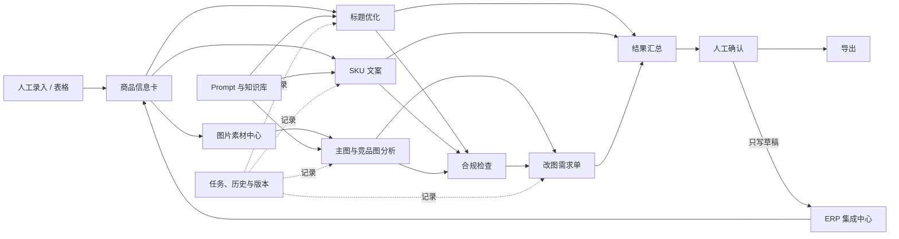

# AI 电商运营助手系统——模块功能说明书

> 文档版本：V0.1  
> 文档状态：讨论稿  
> 当前阶段：产品规划，不进入编码  
> 适用范围：以拼多多商品运营为首要场景，同时为 ERP 对接和其他电商平台预留扩展能力

---

## 0. 文档使用说明

这份文档用于确定系统“需要具备哪些模块、每个模块解决什么问题、用户如何操作以及什么结果才算完成”。它是后续原型、PRD、接口文档和开发任务的共同基础。

文档中的标记含义：

- **MVP**：第一版必须具备。
- **P1**：MVP 稳定后优先增加。
- **P2**：远期能力，当前只预留扩展位置。
- **【待确认】**：需要结合实际运营方法或 ERP 情况决定，可直接修改。
- **【建议】**：当前推荐方案，可根据你的判断调整。

修改时建议直接保留原文并在下方增加“修改为：……”，等内容确定后再统一清理。

---

## 1. 产品定位

### 1.1 产品目标

系统帮助电商运营人员将以下工作串成一条可重复、可追溯的商品运营流程：

1. 从人工录入、表格或 ERP 获取商品资料。
2. 整理成统一、完整的商品信息卡。
3. 分析商品主图、原图和竞品图。
4. 生成商品标题和 SKU 展示文案。
5. 检查违规词、夸大表达和信息冲突。
6. 生成美工可以直接执行的改图需求单。
7. 人工选择并确认最终版本。
8. 导出结果，或将确认后的内容写回 ERP 草稿区。
9. 将历史项目、优秀结果和 Prompt 沉淀为知识库。

### 1.2 核心原则

- 商品信息卡是系统内部的统一事实来源。
- AI 只提供分析和建议，最终结果由运营人员确认。
- AI 生成结果、人工修改、合规检查和 ERP 写回都要留痕。
- 核心模块不能绑定某一家 ERP，通过独立适配器完成对接。
- 默认不自动发布商品，也不允许 AI 无审核写回 ERP。
- 合规检查用于辅助运营，不替代平台最终审核。

### 1.3 目标用户

| 用户角色 | 主要需求 | MVP 处理方式 |
|---|---|---|
| 电商运营 | 建项目、整理商品、生成内容、检查合规、确认结果 | MVP 主要用户 |
| 店铺负责人 | 查看项目进度、审核最终方案、查看效率 | 首版可通过项目状态和导出报告满足 |
| 美工 | 查看图片问题、修改要求和验收标准 | 首版通过改图需求单满足 |
| 系统管理员 | 管理 Prompt、合规规则、ERP 连接和系统参数 | MVP 可与运营使用同一账号，后续拆分权限 |

---

## 2. 模块总览

| 编号 | 模块 | 主要作用 | 优先级 |
|---|---|---|---|
| M01 | 账号与用户 | 登录、个人设置和后续权限扩展 | P1，MVP 预留 |
| M02 | 工作台与项目管理 | 新建、查找、推进和归档商品项目 | MVP |
| M03 | 商品信息卡 | 统一保存商品事实、卖点、规格和生成约束 | MVP |
| M04 | ERP 集成中心 | 导入 ERP 商品、映射字段、同步及人工确认写回 | MVP 预留，P1 实接 |
| M05 | 图片素材中心 | 管理商品原图、主图、竞品图和参考图 | MVP |
| M06 | 主图与竞品图分析 | 识别图片内容、问题、风险和可借鉴方向 | MVP |
| M07 | 商品标题优化 | 生成、解释、比较并确认商品标题 | MVP |
| M08 | SKU 文案生成 | 将规格组合转成简短一致的 SKU 展示文案 | MVP |
| M09 | 合规检查 | 检查风险词、误导表达和商品信息冲突 | MVP |
| M10 | 改图需求单 | 将分析结果转换成美工可执行任务 | MVP |
| M11 | AI 任务与工作流 | 统一管理 AI 任务、运行状态、重试和任务上下文 | MVP |
| M12 | Prompt 与知识库 | 管理 Prompt 版本、优秀案例和运营经验 | MVP 基础版 |
| M13 | 历史记录与版本 | 保存每次生成、编辑、确认和恢复记录 | MVP |
| M14 | 结果汇总与导出 | 汇总最终成果，支持复制、下载和交付 | MVP |
| M15 | 规则与系统设置 | 管理平台规则、合规词库和生成默认参数 | MVP 基础版 |
| M16 | 数据看板 | 统计采用率、节省时间、风险和返工情况 | P1 |

### 2.1 模块关系

---

## 3. M01 账号与用户模块

### 3.1 模块目标

识别当前使用者，保存个人偏好，并为未来多人协作和权限控制预留基础。

### 3.2 功能清单

| 功能编号 | 功能 | 功能描述 | 优先级 |
|---|---|---|---|
| M01-F01 | 单用户模式 | MVP 可使用一个默认本地用户，避免登录系统拖慢首版 | MVP |
| M01-F02 | 登录与退出 | 使用邮箱、手机号或第三方账号登录 | P1 |
| M01-F03 | 个人资料 | 修改昵称、头像、默认平台、默认店铺 | P1 |
| M01-F04 | 角色权限 | 区分运营、审核人、美工和管理员 | P1 |
| M01-F05 | 操作人记录 | 在确认、规则修改、ERP 写回等操作中记录操作者 | MVP 预留 |

### 3.3 业务规则

- MVP 可以不制作完整登录页面，但所有业务表保留 `user_id` 或 `operator_id`。
- ERP 写回、最终版确认、合规规则修改必须能够追溯到操作人。
- 后续多人模式中，普通运营不能修改全局 Prompt、密钥或 ERP 连接。

### 3.4 验收标准

- 单用户模式下可以正常使用全部 MVP 功能。
- 将来增加登录和角色时，不需要修改项目、任务和内容版本的核心结构。

---

## 4. M02 工作台与项目管理模块

### 4.1 模块目标

以“一个商品运营项目”为单位组织商品资料、图片、AI 任务、最终结果和 ERP 对应关系。

### 4.2 核心场景

- 为一个新商品建立运营项目。
- 从 ERP 商品快速创建项目。
- 继续处理尚未完成的商品。
- 搜索过去的商品并复用结果。
- 将完成或暂停的项目归档。

### 4.3 功能清单

| 功能编号 | 功能 | 功能描述 | 优先级 |
|---|---|---|---|
| M02-F01 | 新建项目 | 输入项目名、平台、店铺、类目和来源 | MVP |
| M02-F02 | ERP 导入建项目 | 选择 ERP 商品后创建项目并填充商品卡 | P1；MVP 预留入口 |
| M02-F03 | 项目列表 | 展示名称、商品、平台、状态、更新时间、风险提示 | MVP |
| M02-F04 | 搜索与筛选 | 按商品名、项目名、平台、状态、标签搜索 | MVP |
| M02-F05 | 项目概览 | 展示资料完整度、各模块完成状态、最终结果和待处理事项 | MVP |
| M02-F06 | 修改状态 | 将项目设为草稿、处理中、待确认、已完成或已归档 | MVP |
| M02-F07 | 复制项目 | 复制商品卡、Prompt 选择和部分设置，图片默认不复制 | P1 |
| M02-F08 | 删除/归档 | 优先归档；删除前展示将受影响的数据 | MVP |

### 4.4 项目状态

| 状态 | 含义 | 进入条件 |
|---|---|---|
| 草稿 | 资料尚未填写完整 | 新建项目默认状态 |
| 处理中 | 已开始执行图片、标题或 SKU 等任务 | 任一业务任务启动 |
| 待确认 | 已有候选结果，等待人工选择 | 至少一个模块存在待确认内容 |
| 已完成 | 必要结果均已确认 | 【待确认】需要确认哪些模块为“必要” |
| 已归档 | 暂不继续处理，但保留全部历史 | 用户主动归档 |

### 4.5 页面信息

项目卡片建议显示：

- 项目名称和商品名称。
- 平台、类目、店铺。
- 资料完整度。
- 标题、SKU、图片分析、合规、改图需求的完成状态。
- 高风险合规问题数量。
- 是否关联 ERP 及最后同步时间。
- 最后修改时间。

### 4.6 异常与边界

- 商品卡不完整时允许保存草稿，但生成按钮需要说明缺失字段。
- 已关联 ERP 的项目删除前必须提示外部映射不会自动删除 ERP 商品。
- 项目归档后默认禁止发起新 AI 任务，恢复后可继续。

### 4.7 验收标准

- 用户可以新建、查找、进入、归档和恢复项目。
- 离开页面后，项目状态和已完成内容不会丢失。
- 项目概览能清楚告诉用户下一步应该做什么。

---

## 5. M03 商品信息卡模块

### 5.1 模块目标

把分散的商品资料整理成统一、可信、可被所有 AI 模块复用的结构化信息，减少不同模块生成结果互相矛盾。

### 5.2 信息分组

| 分组 | 建议字段 | 说明 |
|---|---|---|
| 来源信息 | 录入方式、ERP 来源、外部店铺 ID、外部商品 ID、外部版本 | 系统自动管理，用户通常只读 |
| 基础信息 | 平台、店铺、商品内部名称、当前标题、类目、品牌 | 商品识别信息 |
| 商品属性 | 材质、尺寸、颜色、功能、适用场景、包装清单 | 按类目扩展 |
| 目标人群 | 使用者、购买者、痛点、使用环境 | 用于标题和视觉建议 |
| 价格信息 | 成本、售价区间、活动价、价格定位 | 【待确认】MVP 是否录入成本 |
| 卖点信息 | 核心卖点、辅助卖点、证据、不可宣传点 | 卖点与证据要分开 |
| 规格信息 | 规格维度、属性值、商家编码、库存、价格 | SKU 模块的输入 |
| 文案约束 | 必须包含词、禁用词、标题长度、语气、竞品差异 | 控制 AI 输出 |
| 图片要求 | 主图比例、尺寸、背景、必须展示内容、禁改项 | 图片分析和需求单输入 |

### 5.3 功能清单

| 功能编号 | 功能 | 功能描述 | 优先级 |
|---|---|---|---|
| M03-F01 | 分组编辑 | 按基础、属性、卖点、规格、约束分区编辑 | MVP |
| M03-F02 | 自动保存 | 用户修改后自动保存，并显示保存状态 | MVP |
| M03-F03 | 完整度检查 | 提示缺失字段以及会影响哪些生成任务 | MVP |
| M03-F04 | ERP 数据标记 | 区分 ERP 原始字段、人工补充字段和 AI 建议字段 | MVP 预留 |
| M03-F05 | 数据刷新 | 从 ERP 获取新版本并显示差异 | P1 |
| M03-F06 | 字段锁定 | 将确认的事实字段锁定，避免 AI 或同步意外覆盖 | P1 |
| M03-F07 | 导入表格 | 从统一模板批量导入商品和 SKU | P1 |

### 5.4 业务规则

- 商品卡中的事实字段不能被 AI 直接改写。
- ERP 导入的信息先进入“外部快照”，经映射后填充商品卡。
- 人工修改过的字段再次同步时不能静默覆盖，应显示差异。
- “卖点”和“卖点证据”分开保存；没有证据的绝对化表达进入合规检查。
- 每次发起 AI 任务时保存当时的商品卡快照，保证结果可追溯。

### 5.5 异常与提示

- 必填字段缺失：指出缺什么，以及补充后能改善什么。
- SKU 规格重复：提示重复组合并阻止进入写回流程。
- 商品属性与标题冲突：例如商品卡为“不含电池”，标题出现“含电池”，标记高风险。
- ERP 已更新：显示“外部数据有新版本”，由用户决定刷新或保留当前内容。

### 5.6 验收标准

- 同一商品卡可为标题、SKU、图片分析、合规和需求单提供统一输入。
- 用户能区分外部导入、人工填写和 AI 建议的内容。
- 缺失信息不会导致系统盲目生成确定性结论。

---

## 6. M04 ERP 集成中心模块

### 6.1 模块目标

在不绑定具体 ERP 厂商的前提下，支持商品资料导入、字段映射、同步状态查看，以及人工确认后将最终内容写回 ERP 草稿区。

### 6.2 接入阶段

| 阶段 | 能力 | 当前计划 |
|---|---|---|
| 阶段 A | 统一商品模型、接口契约、字段映射模板、模拟 ERP | MVP 规划和预留 |
| 阶段 B | 连接第一家 ERP，只读导入商品、SKU 和图片 | P1 第一阶段 |
| 阶段 C | 写回预览，人工确认后写回商品草稿 | P1 第二阶段 |
| 阶段 D | 增量同步、Webhook、库存/销量参考数据 | P2 |
| 阶段 E | 自动发布 | 当前不规划 |

### 6.3 功能清单

| 功能编号 | 功能 | 功能描述 | 优先级 |
|---|---|---|---|
| M04-F01 | 连接配置 | 选择 ERP 厂商，填写或授权连接信息 | P1 |
| M04-F02 | 连接测试 | 检查凭证、店铺、授权范围和可用能力 | P1 |
| M04-F03 | 能力识别 | 显示该 ERP 是否支持商品读取、图片读取、草稿写回、Webhook 等 | P1 |
| M04-F04 | 字段映射 | 将 ERP 字段映射到统一商品模型 | MVP 规划，P1 使用 |
| M04-F05 | 商品选择 | 按店铺、商品名、外部商品 ID 搜索并选择商品 | P1 |
| M04-F06 | 导入预览 | 导入前展示商品、SKU、图片和缺失字段 | P1 |
| M04-F07 | 创建/更新项目 | 从 ERP 商品创建项目，或刷新已有项目 | P1 |
| M04-F08 | 差异比较 | 对比 ERP 新数据、本地商品卡和人工修改 | P1 |
| M04-F09 | 同步任务 | 查看导入进度、成功数、失败数和重试状态 | P1 |
| M04-F10 | 写回预览 | 展示将修改的 ERP 字段、修改前后内容和冲突 | P1 |
| M04-F11 | 人工确认写回 | 只把最终版且已通过检查的内容写入草稿 | P1 |
| M04-F12 | 同步与写回日志 | 记录操作人、时间、对象、结果和错误 | P1 |
| M04-F13 | 表格适配器 | 无开放 API 时使用 CSV/XLSX 完成同样的导入导出流程 | P1 备选 |

### 6.4 导入范围

首个 ERP 连接器建议只导入：

- 店铺与平台标识。
- 商品/SPU 标识、商品名称、当前标题、类目和品牌。
- SKU 编码、规格组合、展示名、价格和库存。
- 商品主图、详情图和 SKU 图的可访问引用。
- 外部商品更新时间、版本号或内容哈希。

以下数据暂不导入：

- 消费者姓名、电话、地址等个人信息。
- 订单详情、售后、采购、仓储和财务数据。
- ERP 内与本系统无关的复杂业务配置。

### 6.5 写回范围

首阶段允许写回：

- 人工确认的商品标题。
- 人工确认的 SKU 展示文案。
- 【待确认】人工确认的卖点短文案。
- 【待确认】已经上传至合规存储的图片引用。

首阶段禁止写回：

- 商品价格、库存、商家编码。
- 未确认的 AI 候选内容。
- 存在高风险合规问题的内容。
- 平台在售版本；只允许草稿或待发布区。

### 6.6 核心业务规则

- 系统内部使用统一商品模型，核心模块不得直接读取特定 ERP 的原始字段。
- 每个 ERP 通过独立适配器处理认证、分页、限流、错误码和字段格式。
- 写回前必须执行预览、合规检查、外部版本检查和用户确认。
- 外部商品在导入后被修改时停止写回，不能静默覆盖。
- 所有写回带幂等键，相同请求重复提交只能产生一次结果。
- ERP 密钥不能明文保存在业务数据库或日志中。
- 如果 ERP 不支持草稿写回，系统只提供复制或文件导出。

### 6.7 页面建议

ERP 集成中心包含：

1. 连接列表：厂商、店铺、状态、权限、最后验证时间。
2. 字段映射：ERP 原字段、示例值、系统字段、转换规则、必填状态。
3. 商品导入：搜索、勾选、预览、创建项目。
4. 同步记录：任务状态、进度、成功/失败明细、重试。
5. 写回中心：待写回项目、字段差异、风险、确认按钮。

### 6.8 异常处理

| 异常 | 系统处理 |
|---|---|
| 凭证失效 | 停止同步并提示重新授权，不删除历史映射 |
| ERP 限流 | 任务进入等待并自动重试，显示预计状态 |
| 字段无法映射 | 保留原值，标记为待人工处理 |
| 图片地址过期 | 提示重新拉取或人工上传 |
| 商品已在 ERP 中更新 | 阻止写回并展示冲突字段 |
| 部分 SKU 失败 | 成功项保留，失败项单独重试，不整批重复写入 |
| 重复 Webhook | 根据外部事件 ID 去重，不重复更新 |
| ERP 不支持草稿 | 禁用写回按钮，保留导出能力 |

### 6.9 验收标准

- 更换 ERP 厂商时，标题、SKU、图片分析等核心模块不需要修改。
- 导入前后都能看见数据来源、外部 ID 和最后同步时间。
- 写回前可以查看修改前后差异，并明确知道写到哪里。
- 未确认、存在冲突或高风险的内容无法写回。
- 每次同步和写回都有可查询记录。

---

## 7. M05 图片素材中心模块

### 7.1 模块目标

统一管理项目需要的商品图片和参考图片，为视觉分析、改图需求和结果归档提供可靠素材。

### 7.2 图片类型

- 商品原图：未经设计处理的实拍、白底图或细节图。
- 当前主图：店铺正在使用或准备使用的主图。
- 竞品图：用于结构、卖点和视觉策略分析。
- 参考图：用户认可的风格、构图或展示方式。
- SKU 图：与具体规格关联的图片。
- 改图结果：美工修改后返回的图片，P1 支持。

### 7.3 功能清单

| 功能编号 | 功能 | 功能描述 | 优先级 |
|---|---|---|---|
| M05-F01 | 上传图片 | 拖拽或选择本地图片上传 | MVP |
| M05-F02 | ERP 图片导入 | 从 ERP 获取图片引用并导入项目 | P1 |
| M05-F03 | 图片分类 | 上传时或上传后指定图片类型 | MVP |
| M05-F04 | 预览与排序 | 大图预览、缩略图、调整分析顺序 | MVP |
| M05-F05 | 图片信息 | 显示尺寸、格式、文件大小和来源 | MVP |
| M05-F06 | 选择参与分析 | 勾选本次视觉任务需要使用的图片 | MVP |
| M05-F07 | 图片备注 | 记录“只参考构图”“不要参考文案”等说明 | MVP |
| M05-F08 | 删除与替换 | 删除未被最终内容引用的图片，或替换版本 | MVP |
| M05-F09 | 重复检测 | 根据文件哈希提醒重复图片 | P1 |

### 7.4 业务规则

- 每张图片必须记录来源：人工上传、ERP 导入或外部链接。
- 竞品图只用于分析，不自动复制其文案、品牌或受保护元素。
- 删除已被分析或需求单引用的图片时，必须提示影响范围。
- 【待确认】单次视觉分析最多选择多少张图片；建议 MVP 为 5 张。
- 图片地址失效时保留历史元数据和任务输入快照。

### 7.5 验收标准

- 用户可以快速区分商品图、竞品图和参考图。
- 发起分析前能明确看见哪些图片会被发送给 AI。
- 图片删除、替换和来源记录不会破坏历史任务追溯。

---

## 8. M06 主图与竞品图分析模块

### 8.1 模块目标

将图片分析从主观评价变成固定维度的结构化结论，为标题、合规检查和改图需求单提供依据。

### 8.2 分析类型

| 类型 | 目标 |
|---|---|
| 单张主图分析 | 判断商品识别、构图、文案、视觉层级、卖点表达和风险 |
| 多张商品图分析 | 判断多图之间的信息分工、重复和缺失 |
| 竞品图分析 | 提取竞品的展示策略、卖点方向、优缺点和风险 |
| 商品与竞品对比 | 找出差异化机会，不直接照搬竞品内容 |

### 8.3 功能清单

| 功能编号 | 功能 | 功能描述 | 优先级 |
|---|---|---|---|
| M06-F01 | 图片选择 | 选择商品图、竞品图及各自用途 | MVP |
| M06-F02 | OCR 文案识别 | 提取图片中的可见文字并允许人工修正 | MVP |
| M06-F03 | 商品识别 | 判断画面主体、数量、角度、使用场景 | MVP |
| M06-F04 | 视觉结构分析 | 分析构图、颜色、层级、焦点、留白和可读性 | MVP |
| M06-F05 | 卖点表达分析 | 判断图片表达了哪些卖点、证据是否充分 | MVP |
| M06-F06 | 风险分析 | 标记品牌、极限词、误导、信息冲突和素材风险 | MVP |
| M06-F07 | 竞品策略分析 | 提取竞品可借鉴的策略与不可照搬的内容 | MVP |
| M06-F08 | 对比结论 | 输出本商品相对竞品的缺口和差异化建议 | MVP |
| M06-F09 | 人工修正 | 编辑 OCR 和分析结论，并保存为新版本 | MVP |
| M06-F10 | 转需求单 | 将选中的问题和建议加入改图需求单 | MVP |

### 8.4 结构化输出

每次分析至少输出：

- 图片事实：画面中实际存在什么。
- OCR 文案：原文及位置说明。
- 视觉判断：主体、层级、可读性、可信度。
- 卖点判断：已表达、表达不足、缺少证据。
- 合规风险：风险片段、等级、原因。
- 可借鉴策略：只能描述策略，不直接复制竞品文案。
- 修改建议：按高、中、低优先级排列。
- 不确定项：无法从图片确认的信息。

### 8.5 业务规则

- 结果必须区分“图片事实”“AI 判断”和“修改建议”。
- 图片无法看清时必须标记不确定，不能编造文字或商品属性。
- 竞品品牌、Logo、人物肖像和专有文案不能作为直接复制建议。
- 分析结论引用商品属性时，应与商品信息卡进行一致性检查。

### 8.6 验收标准

- 分析结果不是一段散文，而是可以直接筛选和转成需求项的结构化内容。
- 用户可以修正 OCR 和分析结论。
- 主图问题能一键带入改图需求单，并保留来源图片。

---

## 9. M07 商品标题优化模块

### 9.1 模块目标

根据商品事实、目标关键词、平台约束和运营策略，生成多个可解释、可检查、可选择的标题方案。

### 9.2 功能清单

| 功能编号 | 功能 | 功能描述 | 优先级 |
|---|---|---|---|
| M07-F01 | 原标题录入 | 从商品卡/ERP 读取或人工输入当前标题 | MVP |
| M07-F02 | 生成设置 | 设置候选数量、关键词、长度、语气和必须/禁用内容 | MVP |
| M07-F03 | 多候选生成 | 一次生成多个策略不同的标题 | MVP |
| M07-F04 | 方案解释 | 显示关键词覆盖、表达策略、字符数和适用场景 | MVP |
| M07-F05 | 合规联检 | 自动调用合规模块检查标题 | MVP |
| M07-F06 | 人工编辑 | 直接修改候选标题并重新检查 | MVP |
| M07-F07 | 横向对比 | 并排比较候选标题的关键词、长度和风险 | P1 |
| M07-F08 | 确认最终版 | 将一个标题设为最终版本 | MVP |
| M07-F09 | ERP 写回预览 | 比较 ERP 当前标题与最终标题 | P1 |

### 9.3 输入

- 商品信息卡中的商品事实和卖点。
- 当前标题。
- 目标关键词与关键词优先级。
- 平台、类目和标题长度规则。
- 必须包含词和禁用词。
- 【待确认】是否需要录入搜索热词数据。

### 9.4 输出

每个候选标题包含：

- 标题文本。
- 字符数或字节数。
- 覆盖关键词。
- 标题策略说明。
- 与商品事实的一致性结果。
- 合规风险与替换建议。
- 是否经过人工修改。

### 9.5 业务规则

- 不得生成商品卡中没有依据的材质、功能、认证或效果。
- 必须符合配置的平台长度规则；规则不确定时显示提醒，不做虚假保证。
- 最终标题只能有一个；选择新标题时保留旧最终版历史。
- 高风险标题不能进入 ERP 写回流程。
- 标题生成使用的商品卡和 Prompt 版本必须留存。

### 9.6 验收标准

- 一次至少生成【建议：5】个具有明显差异的候选标题。
- 用户能理解每个候选的策略，不需要猜测差异。
- 标题可编辑、重检、确认和回退。

---

## 10. M08 SKU 文案生成模块

### 10.1 模块目标

根据商品规格组合生成简洁、统一、无歧义的 SKU 展示文案，同时保护 ERP 中的商家编码、价格和库存等事实字段。

### 10.2 功能清单

| 功能编号 | 功能 | 功能描述 | 优先级 |
|---|---|---|---|
| M08-F01 | 规格读取 | 从商品卡、表格或 ERP 读取规格维度和属性值 | MVP |
| M08-F02 | 规格整理 | 识别颜色、尺寸、款式、数量等维度 | MVP |
| M08-F03 | 命名规则设置 | 设置顺序、长度、分隔符、缩写和禁用词 | MVP |
| M08-F04 | 批量生成 | 为全部规格组合生成建议展示名 | MVP |
| M08-F05 | 原值对照 | 并排展示原规格和建议文案 | MVP |
| M08-F06 | 歧义检查 | 检查重复、信息缺失、含义不清和名称过长 | MVP |
| M08-F07 | 逐条/批量编辑 | 单条修改或批量替换共同词 | MVP |
| M08-F08 | 最终确认 | 锁定一组 SKU 展示文案 | MVP |
| M08-F09 | ERP 写回预览 | 只预览展示名变化，不修改编码、价格和库存 | P1 |

### 10.3 业务规则

- SKU 商家编码、条码、价格和库存默认只读，AI 不得修改。
- 同一商品下的 SKU 展示名不能重复。
- 规格文案必须保持统一顺序，例如“颜色 + 尺寸 + 数量”。
- 缩写必须来自已确认规则，不能自动创造用户无法理解的缩写。
- ERP 写回时按外部 SKU ID 对应，不能依赖名称匹配。

### 10.4 异常处理

- ERP SKU 缺少外部 ID：允许展示，不允许写回。
- 不同规格生成相同名称：标记冲突并阻止确认。
- SKU 数量过多：进入后台任务，展示生成进度和失败项。
- 商品卡规格与 ERP 不一致：要求先解决映射或刷新问题。

### 10.5 验收标准

- 用户能从原规格清楚看到每个建议名称的变化。
- 系统能发现重复和歧义。
- 确认 SKU 文案不会改变编码、库存和价格。

---

## 11. M09 合规检查模块

### 11.1 模块目标

对标题、SKU、图片文案、卖点和改图需求中的文字进行统一检查，尽早发现明显违规、夸大宣传和信息冲突。

### 11.2 检查类型

| 类型 | 说明 |
|---|---|
| 确定性词库检查 | 极限词、禁用词、敏感品牌词、联系方式等明确规则 |
| 格式规则检查 | 标题长度、重复字符、特殊符号和 SKU 长度 |
| 语义风险检查 | 隐含承诺、绝对化表达、可能误导的描述 |
| 信息一致性检查 | 标题、SKU、图片文案与商品卡之间的冲突 |
| 证据完整性检查 | 认证、效果、数据或对比结论是否有依据 |

### 11.3 功能清单

| 功能编号 | 功能 | 功能描述 | 优先级 |
|---|---|---|---|
| M09-F01 | 自动联检 | 标题、SKU、需求单生成后自动检查 | MVP |
| M09-F02 | 临时文本检查 | 粘贴任意文案并立即检查 | MVP |
| M09-F03 | 风险定位 | 高亮具体风险片段 | MVP |
| M09-F04 | 风险解释 | 显示风险等级、原因和规则来源说明 | MVP |
| M09-F05 | 替换建议 | 给出更安全的表达方式 | MVP |
| M09-F06 | 一致性检查 | 对比商品卡、标题、SKU 和图片 OCR | MVP |
| M09-F07 | 人工处理 | 接受建议、手动修改或标记已知风险 | MVP |
| M09-F08 | 复检 | 修改后重新检查并保存新报告 | MVP |
| M09-F09 | 自定义规则 | 添加店铺或类目自己的风险词 | P1 |

### 11.4 风险等级

| 等级 | 含义 | 默认处理 |
|---|---|---|
| 高风险 | 明显禁用、严重信息冲突或缺少关键依据 | 阻止最终确认和 ERP 写回 |
| 中风险 | 可能误导、上下文不充分或存在歧义 | 允许保存，确认前要求人工处理 |
| 低风险 | 可读性、风格或信息完整性问题 | 提醒，不强制阻止 |

### 11.5 业务规则

- 每个风险必须展示原文片段、风险等级、原因和修改建议。
- 规则库命中与 AI 语义判断要分开标记，不能混为同一种结论。
- 用户忽略中风险时需要记录原因；高风险默认不能忽略。【待确认】管理员是否可以强制放行。
- 合规规则需要记录适用平台、类目、版本和来源说明。
- 平台规则变化后，旧报告保留原规则版本，不自动改写历史结论。

### 11.6 验收标准

- 用户能在原文中快速定位风险，而不是只看到“有违规”。
- 修改后可以复检，并保留前后版本。
- 高风险内容不能被误写回 ERP。

---

## 12. M10 改图需求单模块

### 12.1 模块目标

将商品资料、图片分析、标题卖点和合规结论转换成美工可以理解、执行和验收的任务单。

### 12.2 需求单结构

1. 项目与商品信息。
2. 本次改图目标。
3. 原图及参考图。
4. 当前存在的问题。
5. 逐项修改要求。
6. 最终文案清单。
7. 尺寸、比例、格式要求。
8. 必须保留内容。
9. 禁止修改或禁止出现的内容。
10. 仍缺少的素材。
11. 验收标准。

### 12.3 功能清单

| 功能编号 | 功能 | 功能描述 | 优先级 |
|---|---|---|---|
| M10-F01 | 选择分析结论 | 从图片分析中勾选需要处理的问题 | MVP |
| M10-F02 | 自动生成需求单 | 按固定结构组织修改任务 | MVP |
| M10-F03 | 引用图片 | 每个修改项关联具体原图或参考图 | MVP |
| M10-F04 | 优先级排序 | 标记必须修改、建议修改和可选优化 | MVP |
| M10-F05 | 文案同步 | 引用已确认标题、卖点和合规后的图片文案 | MVP |
| M10-F06 | 人工编辑 | 添加、删除、重排和改写需求项 | MVP |
| M10-F07 | 合规复检 | 对需求单中准备上图的文案再次检查 | MVP |
| M10-F08 | 确认与导出 | 设为最终版并复制/导出给美工 | MVP |
| M10-F09 | 美工反馈 | 上传改图结果并标记完成情况 | P1 |

### 12.4 业务规则

- 修改要求必须具体到对象、位置、动作和预期结果。
- “更好看”“高级一点”等模糊要求应转换成可执行描述，无法转换时提醒用户补充。
- 竞品图只能作为方向参考，需求单不能要求复制品牌、Logo 或专有文案。
- 最终文案必须来自已确认内容或在需求单中重新通过合规检查。
- 每个验收标准尽量可观察，例如“手机端缩略图能看清核心卖点”。

### 12.5 验收标准

- 美工无需阅读整个项目历史即可理解任务。
- 每个重点修改项有对应图片、优先级和验收标准。
- 导出的需求单与系统最终确认版本一致。

---

## 13. M11 AI 任务与工作流模块

### 13.1 模块目标

统一处理所有 AI 任务，保证输入完整、状态可见、失败可恢复、结果可追溯。

### 13.2 功能清单

| 功能编号 | 功能 | 功能描述 | 优先级 |
|---|---|---|---|
| M11-F01 | 任务创建 | 根据任务类型收集商品卡、图片、Prompt 和规则 | MVP |
| M11-F02 | 输入预览 | 发起前告诉用户将使用哪些信息 | MVP |
| M11-F03 | 状态展示 | 显示排队、运行、成功、失败和取消状态 | MVP |
| M11-F04 | 结构校验 | 检查 AI 返回结果是否符合预期字段 | MVP |
| M11-F05 | 失败重试 | 对可重试错误自动或人工重试 | MVP |
| M11-F06 | 结果落库 | 保存原始结果、结构化结果和内容版本 | MVP |
| M11-F07 | 任务取消 | 对尚未完成的任务发出取消请求 | P1 |
| M11-F08 | 成本与耗时记录 | 记录模型、耗时和用量 | P1 |

### 13.3 任务状态

- `queued`：已创建，等待执行。
- `running`：正在调用模型或处理结果。
- `succeeded`：成功并产生内容版本。
- `failed`：失败，显示原因和是否可重试。
- `cancelled`：被用户取消。

### 13.4 业务规则

- 每个任务保存商品卡快照、图片 ID、Prompt 版本和规则版本。
- 结构校验失败时最多自动修复或重试【建议：1】次，避免无限调用。
- 相同按钮被连续点击时不能创建大量重复任务。
- AI 任务失败不能覆盖已有成功结果。
- 任务结果必须进入具体业务模块，不以孤立聊天记录作为唯一保存方式。

### 13.5 验收标准

- 用户随时知道任务正在做什么以及是否成功。
- 失败后能看到可理解的原因和下一步操作。
- 任一结果都能追溯到当时的输入和 Prompt。

---

## 14. M12 Prompt 与知识库模块

### 14.1 模块目标

将有效的 Prompt、运营规则、优秀案例和人工经验沉淀为可搜索、可复用、可版本管理的知识资产。

### 14.2 内容类型

- Prompt 模板。
- 平台/类目运营说明。
- 标题优秀案例。
- SKU 命名案例。
- 图片分析案例。
- 改图需求单案例。
- 常见错误和修正方法。

### 14.3 功能清单

| 功能编号 | 功能 | 功能描述 | 优先级 |
|---|---|---|---|
| M12-F01 | 模板列表 | 按任务类型查看 Prompt | MVP |
| M12-F02 | 查看与复制 | 查看模板说明、输入要求和示例 | MVP |
| M12-F03 | 标签搜索 | 按平台、类目、任务类型和标签搜索 | MVP |
| M12-F04 | Prompt 版本 | 修改时创建新版本，旧任务继续引用旧版本 | MVP |
| M12-F05 | 发布状态 | 区分草稿、启用和停用 | MVP |
| M12-F06 | 优秀结果入库 | 将人工确认的结果保存为案例 | MVP |
| M12-F07 | 案例来源 | 记录案例来自哪个项目和内容版本 | MVP |
| M12-F08 | Prompt 测试 | 使用固定样例比较新旧版本结果 | P1 |
| M12-F09 | 评分与推荐 | 根据采用率推荐效果更好的模板 | P1 |

### 14.4 业务规则

- 已被任务使用的 Prompt 版本不能原地覆盖。
- Prompt 模板包含目标、上下文、限制、任务指令和输出结构。
- 知识库案例进入前应去除不适合复用的店铺或商品敏感信息。
- AI 不能自行把未确认结果标记为优秀案例。

### 14.5 验收标准

- 每类 MVP AI 任务至少有一个启用模板。
- 可以查询某次结果使用了哪个 Prompt 版本。
- 优秀案例可以被搜索和复用，但不会覆盖商品事实。

---

## 15. M13 历史记录与版本模块

### 15.1 模块目标

保存生成、编辑、确认、合规检查和 ERP 写回全过程，支持回看、比较和恢复。

### 15.2 功能清单

| 功能编号 | 功能 | 功能描述 | 优先级 |
|---|---|---|---|
| M13-F01 | 项目时间线 | 按时间展示生成、修改、确认和写回事件 | MVP |
| M13-F02 | 内容版本 | 标题、SKU、分析和需求单分别保存版本 | MVP |
| M13-F03 | 输入快照 | 查看生成时使用的商品卡、图片和规则 | MVP |
| M13-F04 | 版本对比 | 对比 AI 原始结果、人工编辑和最终版 | P1 |
| M13-F05 | 恢复旧版 | 将旧版本复制为新版本，不直接删除新内容 | P1 |
| M13-F06 | 最终版标记 | 每种内容类型只保留一个当前最终版 | MVP |
| M13-F07 | 操作审计 | 记录重要操作的人员、时间和结果 | MVP 预留 |

### 15.3 业务规则

- 历史版本原则上不物理删除，只允许隐藏或归档。
- 恢复旧版本会产生一个新版本，保证时间线完整。
- ERP 写回记录必须引用具体的最终内容版本。
- Prompt、规则和商品卡后续变化不能改变旧任务快照。

### 15.4 验收标准

- 任一最终结果都可以说明“从哪里来、经过哪些修改、由谁确认”。
- 用户误改内容后仍有恢复路径。
- ERP 写回结果与具体内容版本一一对应。

---

## 16. M14 结果汇总与导出模块

### 16.1 模块目标

将分散在各模块中的最终内容整理为单个可交付、可复制、可下载的项目结果包。

### 16.2 汇总内容

- 商品信息卡摘要。
- 最终标题。
- 最终 SKU 文案表。
- 主图/竞品图核心结论。
- 合规检查结果和待人工注意事项。
- 最终改图需求单。
- 关联图片清单。
- 生成、确认和 ERP 同步信息。

### 16.3 功能清单

| 功能编号 | 功能 | 功能描述 | 优先级 |
|---|---|---|---|
| M14-F01 | 结果总览 | 展示各模块最终版和未完成项 | MVP |
| M14-F02 | 一键复制 | 复制标题、SKU 或需求单文本 | MVP |
| M14-F03 | Markdown 导出 | 导出单项目完整报告 | MVP |
| M14-F04 | 表格导出 | 导出 SKU 和商品字段为 XLSX/CSV | P1 |
| M14-F05 | 文档导出 | 导出美工需求单为 PDF/DOCX | P1 |
| M14-F06 | 写回入口 | 从结果页进入 ERP 写回预览 | P1 |
| M14-F07 | 导出记录 | 记录格式、时间、版本和操作人 | P1 |

### 16.4 业务规则

- 默认只导出各模块当前最终版。
- 有高风险或待确认内容时，导出报告必须明显提示。
- 导出后修改了最终内容，应重新生成报告，旧报告保留版本信息。
- ERP 写回与文件导出是两种独立交付方式，互不替代。

### 16.5 验收标准

- 导出内容与页面上确认的最终版完全一致。
- 用户不需要在多个页面手工拼接信息。
- 报告能看出项目、生成时间和内容版本。

---

## 17. M15 规则与系统设置模块

### 17.1 模块目标

集中管理平台规则、合规词库、生成默认值和系统集成设置，避免规则散落在代码或个人 Prompt 中。

### 17.2 功能清单

| 功能编号 | 功能 | 功能描述 | 优先级 |
|---|---|---|---|
| M15-F01 | 平台设置 | 管理平台名称、标题长度和图片基础要求 | MVP 基础版 |
| M15-F02 | 合规规则查看 | 查看规则、风险等级、适用范围和来源说明 | MVP |
| M15-F03 | 自定义词条 | 添加店铺或类目自定义风险词 | P1 |
| M15-F04 | 默认生成参数 | 设置候选数量、默认语气和输出语言 | P1 |
| M15-F05 | ERP 入口 | 进入 ERP 连接和字段映射 | P1 |
| M15-F06 | 模型设置 | 由管理员选择可使用的文本/视觉模型 | P1 |
| M15-F07 | 数据保留设置 | 设置图片、日志和历史数据保留策略 | P1 |

### 17.3 业务规则

- 全局规则修改需要记录版本和操作人。
- 平台规则与店铺自定义规则同时命中时，采用更严格的处理方式。
- 密钥和 Token 只显示连接状态，不在页面回显完整值。
- 规则来源不明确时标记为内部经验规则，不能伪装成平台官方规则。

### 17.4 验收标准

- 业务规则可以被查看和追溯，而不是隐藏在 Prompt 中。
- 修改规则不会改变历史合规报告。
- 普通运营不能查看完整密钥或执行高风险系统设置。

---

## 18. M16 数据看板模块

### 18.1 模块目标

衡量系统是否真正节省运营时间、提高采用率并减少返工，为产品迭代提供依据。

### 18.2 建议指标

| 指标 | 定义 |
|---|---|
| 项目数量 | 新建、处理中、完成和归档项目数 |
| 单项目处理耗时 | 从项目创建到最终确认的时长 |
| AI 采用率 | AI 候选被直接采用或修改后采用的比例 |
| 平均修改次数 | 每个最终内容经历的人工版本数量 |
| 合规风险数 | 高、中、低风险的发现和处理数量 |
| 需求单返工率 | 美工需求单被退回或修改的次数 |
| ERP 导入成功率 | 导入成功商品数/计划导入商品数 |
| ERP 写回成功率 | 成功写回数量/确认写回数量 |

### 18.3 功能清单

| 功能编号 | 功能 | 功能描述 | 优先级 |
|---|---|---|---|
| M16-F01 | 时间范围筛选 | 按日期、平台、店铺和类目查看 | P1 |
| M16-F02 | 效率指标 | 展示项目耗时、采用率和修改次数 | P1 |
| M16-F03 | 风险统计 | 展示常见风险词和信息冲突 | P1 |
| M16-F04 | ERP 统计 | 展示同步和写回成功率 | P1 |
| M16-F05 | 数据导出 | 导出指标明细 | P2 |

### 18.4 业务规则

- 没有完整操作数据时不展示虚假的“节省时间”。
- 节省时间需要与人工基准或用户填写的原耗时对比。【待确认】基准如何采集。
- 看板指标只能用于改进流程，不能取代对具体商品结果的人工判断。

---

## 19. 全局业务规则

### 19.1 人工确认规则

- AI 生成内容初始状态均为“待确认”。
- 人工修改后需要重新执行相关合规检查。
- 每种内容类型只能有一个当前最终版，但历史最终版仍保留。
- 未确认或有高风险的内容不能写回 ERP。

### 19.2 数据来源规则

所有关键字段建议显示来源：

- ERP 导入。
- 人工填写。
- AI 建议。
- 表格导入。
- 系统规则计算。

AI 建议不能自动升级为商品事实。

### 19.3 状态一致性规则

- 商品卡发生关键变化后，旧标题、SKU、图片分析和需求单显示“可能已过期”。
- 最终标题修改后，合规报告和 ERP 写回预览需要重新生成。
- SKU 结构变化后，旧 SKU 文案最终版失效，但历史记录保留。
- 图片替换后，引用旧图的分析和需求单需要提示重新检查。

### 19.4 删除规则

- 项目优先归档，不直接物理删除。
- 被任务或最终内容引用的图片不能直接删除。
- 已使用的 Prompt 和规则版本不能删除，只能停用。
- ERP 外部商品不会因本系统项目删除而被删除。

### 19.5 错误提示规则

错误提示至少说明：

1. 发生了什么。
2. 哪些数据受到影响。
3. 是否可以重试。
4. 用户下一步应该怎么做。

避免只显示“系统错误”“生成失败”等无法行动的提示。

---

## 20. 非功能要求

### 20.1 可追溯性

- 保存任务输入快照、Prompt 版本、规则版本、模型名称和输出。
- 记录最终确认、ERP 写回和重要设置修改的操作人。
- 历史结果不能因模板或规则更新而被自动改写。

### 20.2 安全与隐私

- ERP 凭证加密存储或保存在专门的密钥服务中。
- 日志不记录完整 Token、Secret 或消费者隐私信息。
- 第一阶段不导入订单消费者个人数据。
- 上传图片和商品数据的保存范围应在界面中说明。

### 20.3 稳定性

- AI、ERP 或图片存储暂时不可用时，已保存项目仍可查看和编辑。
- 长任务使用后台状态，不让页面一直无反馈等待。
- 可重试任务不能产生重复内容或重复 ERP 写回。

### 20.4 性能建议

- 项目列表和历史记录需要分页。
- 图片上传前进行格式、尺寸和大小检查。
- 【待确认】文本任务目标响应时间建议为 60 秒以内。
- 【待确认】1–5 张图片分析目标响应时间建议为 120 秒以内。

### 20.5 易用性

- 生成按钮附近说明需要哪些输入。
- 缺失字段提供直接跳转到编辑位置的入口。
- 高风险、待确认、已完成使用一致的颜色和文字标识。
- 重要写回操作必须展示预览和二次确认。

---

## 21. MVP 范围汇总

### 21.1 MVP 实际功能

- 工作台与项目管理。
- 商品信息卡。
- 图片素材上传与分类。
- 主图/竞品图结构化分析。
- 标题优化。
- SKU 文案生成。
- 合规检查。
- 改图需求单。
- AI 任务状态与失败重试。
- Prompt 知识库基础版。
- 历史版本与最终版确认。
- Markdown 结果导出。

### 21.2 MVP 必须预留但不连接真实服务

- 用户与操作人字段。
- 统一商品模型。
- `ERPConnector` 适配器边界。
- ERP 连接、字段映射、外部实体映射、同步任务和日志数据结构。
- 从 ERP 导入、写回预览、人工确认写回和 Webhook 的接口契约。
- 模拟 ERP 数据的契约测试方案。

### 21.3 MVP 明确不做

- AI 自动发布商品。
- 自动爬取竞品页面。
- 完整复制 ERP 的订单、采购、仓储和财务能力。
- 无人工审核的批量改写。
- 复杂团队权限和企业审批。
- AI 自动生成或直接修改商品图片。

---

## 22. 需要你优先修改或确认的内容

以下决定会直接影响后续原型和 PRD，建议优先在本文中修改：

1. **项目完成条件**：哪些模块完成后，一个项目才算“已完成”？
2. **商品信息卡字段**：你日常做拼多多运营时还必须记录哪些字段？
3. **标题规则**：标题长度、关键词顺序、必须词和禁用词有哪些实际规则？
4. **SKU 命名方法**：你现在的规格顺序、分隔符和常用缩写是什么？
5. **图片分析维度**：除了构图、文案、卖点、风险，还希望 AI 分析什么？
6. **改图需求单格式**：你现在如何把需求交给美工，是否需要固定模板？
7. **合规规则来源**：你已有自己的风险词表、平台提示或历史违规案例吗？
8. **ERP 类型**：计划优先接妙手还是其他 ERP？具体版本是什么？
9. **ERP 权限**：是否有开放 API，还是目前主要使用表格导入导出？
10. **ERP 写回范围**：第一阶段只写标题和 SKU，还是还需要卖点和图片？
11. **导出格式**：除 Markdown 外，是否优先需要 Excel、Word 或 PDF？
12. **多人协作**：首版是否确定只给你一个人使用？

---

## 23. 后续文档顺序

在本模块说明修改确认后，再按顺序制作：

1. 商品信息字段字典。
2. ERP 字段映射模板。
3. 系统业务流程图。
4. 六个核心页面的低保真原型。
5. 正式 PRD。
6. API 与 ERPConnector 接口契约文档。
7. 数据库设计说明。
8. 评审确认后再制定开发任务，不立即编码。

---

## 24. 版本修改记录

| 版本 | 日期 | 修改人 | 修改内容 |
|---|---|---|---|
| V0.1 | 2026-07-26 | 初稿 | 完成系统模块拆分、功能描述和 ERP 预留规划 |
| V0.2 | 【待填写】 | 【待填写】 | 【待填写】 |
