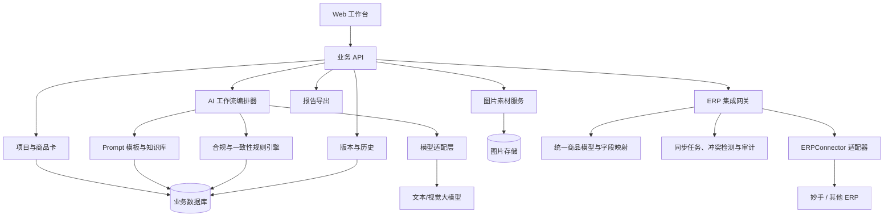

# AI 电商运营助手系统：MVP 制作蓝图

> 暂定产品名：**商策 AI 工作台**  
> 首版定位：面向拼多多中小商家运营，把“整理商品资料—分析图片—生成标题/SKU—合规检查—产出改图需求—归档复用”串成一条可追溯的工作流。
> 当前阶段：**只完成产品、数据和接口规划，不开始编码。**

## 0. 首版边界与关键原则

首版目标不是做一个“什么都能聊”的聊天机器人，而是做一个能稳定完成具体运营任务的工作台。

- 首版服务单人运营或 1–5 人小团队，以拼多多场景为主。
- AI 输出必须经过人工确认，不能直接发布到平台。
- 所有结果使用结构化字段保存，支持版本对比、回看和复用。
- Prompt、规则和生成结果都要留痕，便于解释“为什么得到这个结果”。
- 首版不实际调用 ERP，但从数据模型、模块边界和 API 层预留标准 ERP 接口；后续接入妙手或其他 ERP 时不改核心业务模块。
- ERP 写回必须经过人工确认，默认只写入草稿或待发布区，不能由 AI 自动发布。
- 合规检查是运营辅助，不承诺替代平台最终审核。

---

## 1. 目标用户与核心场景

### 1.1 主要目标用户

**拼多多中小商家运营人员**，典型特征：

- 每天需要处理多个商品，资料散落在聊天记录、表格和图片文件夹里。
- 经常参考竞品，但缺少固定的分析框架。
- 需要反复写标题、SKU 名称、卖点和美工需求。
- 担心极限词、承诺性用语、品牌侵权或信息不一致。
- 已经在使用大模型，但 Prompt 和优秀结果没有系统沉淀。

### 1.2 次要用户

- 店铺负责人：查看项目进度和最终结果。
- 美工：接收结构清楚、可执行的改图需求单。
- 新运营：通过历史项目和 Prompt 知识库快速复用经验。

次要用户暂不做独立权限，只通过导出和分享结果满足需求。

### 1.3 核心任务

用户真正要完成的不是“调用 AI”，而是以下闭环：

1. 新建商品项目并录入基础资料。
2. 上传商品原图、主图或竞品图。
3. 获得结构化的主图/竞品图分析。
4. 生成并筛选商品标题、SKU 文案。
5. 检查违禁词、夸大表达和商品信息冲突。
6. 将分析结论转换成美工能执行的改图需求单。
7. 确认最终版本，导出并沉淀到历史项目和知识库。

### 1.4 MVP 成功标准

首版完成后，一个运营人员应能在同一项目内：

- 用 3 分钟以内建立完整商品信息卡；
- 上传 1–5 张图片并获得结构化分析；
- 一次生成至少 5 个标题方案和一组规范的 SKU 文案；
- 自动标记高、中、低风险词并给出替换建议；
- 一键生成包含目标、问题、修改项、禁改项和验收标准的改图需求单；
- 保存每次生成记录，选定最终版本并导出 Markdown/复制文本；
- 从历史项目或 Prompt 知识库复用已有经验。

---

## 2. MVP 功能拆分

### 2.1 P0：四周内必须完成

| 模块 | MVP 能力 | 完成标准 |
|---|---|---|
| 项目与历史 | 新建、编辑、归档、搜索商品项目 | 可按商品名/状态查找，项目内结果不丢失 |
| 商品信息卡 | 记录平台、类目、商品名、品牌、材质、规格、受众、价格带、核心卖点、禁用表述 | 字段可编辑，作为所有 AI 任务的统一上下文 |
| 图片素材 | 上传商品原图、现有主图、竞品图，并标记类型 | 可预览、删除、选择参与分析的图片 |
| 主图/竞品图分析 | 识别画面构成、卖点、文案、视觉层级、可信度、可借鉴点和风险 | 结果按固定结构呈现，不只返回一段散文 |
| 标题优化 | 基于商品卡和平台规则生成多个标题，解释关键词覆盖与差异 | 至少 5 个候选，可编辑、重生成、选为最终版 |
| SKU 文案 | 根据规格生成短、清晰、一致的 SKU 名称，并检查歧义 | 表格化展示原规格与建议 SKU，可逐条编辑 |
| 合规词检查 | 词库匹配 + AI 语义复核，标记风险等级、原因和替换建议 | 可检查标题、SKU、图片文案和改图需求中的文字 |
| 改图需求单 | 将图片分析、商品卖点和合规结果转换为美工任务单 | 包含修改项、参考方向、禁改项、尺寸/文案和验收标准 |
| Prompt 知识库 | 查看、搜索、复制 Prompt 模板；记录版本、适用场景和示例 | 每类 AI 任务至少 1 个可用模板，修改后产生新版本 |
| 生成历史 | 保存输入快照、Prompt 版本、模型结果、人工编辑和最终选择 | 能定位某个结果来自哪次任务，支持回到旧版本 |
| 导出 | 复制最终内容，导出单项目 Markdown 报告 | 报告覆盖商品卡、最终文案、图片结论、合规风险、需求单 |
| ERP 集成预留 | 定义统一商品模型、ERP 适配器、字段映射、同步任务和回调接口 | 未接真实 ERP 时也能用模拟数据完成契约验证；核心模块不出现特定 ERP 字段 |

### 2.2 P1：MVP 稳定后增加

- 标题版本横向对比和人工评分。
- 批量导入商品信息表，批量生成 SKU。
- 自定义合规词库和类目规则。
- Prompt A/B 测试与“优秀输出”一键入库。
- 项目数据看板：节省时间、采用率、返工次数、常见风险词。
- 登录、多人协作、角色和审阅流程。
- 图片标注和区域级改图建议。
- 接入第一家真实 ERP，优先完成商品、SKU 和图片的只读导入。
- 将人工确认后的标题、SKU 文案写回 ERP 草稿区。

### 2.3 P2：暂不进入首版

- ERP 自动发布、无人工审核写回和高风险批量修改。
- 订单、售后、采购、仓储、财务等完整 ERP 能力复制。
- 自动抓取竞品页面或批量爬虫。
- AI 自动生成/修改图片。
- 自主决定并执行发布的 Agent。
- 复杂审批、计费、企业级权限与审计。

真实 ERP 连接将按“只读导入 → 人工确认后写回草稿 → 可选定时同步”逐步开放；自动发布不进入近期范围。

---

## 3. 页面与操作流程

### 3.1 页面结构

1. **工作台 / 历史项目**：最近项目、搜索、状态筛选、新建项目。
2. **项目详情**：以一个商品为中心，包含六个页签：
   - 商品信息卡
   - 图片与竞品分析
   - 标题与 SKU
   - 合规检查
   - 改图需求单
   - 最终结果与导出
3. **Prompt 知识库**：按任务类型查看模板、版本、标签和优秀示例。
4. **合规规则库**：首版以只读查看为主，可补充自定义词条。

### 3.2 标准用户路径


所有生成按钮都应展示“本次会使用哪些信息”，避免用户不知道 AI 的输入范围。

---

## 4. 系统架构、模块关系与数据流

### 4.1 推荐技术方案

为了兼顾四周内完成和后续作品集扩展，推荐：

- 前端：Next.js + TypeScript + Tailwind CSS。
- 后端：FastAPI；负责项目数据、AI 编排、规则检查和导出。
- 数据库：开发阶段 SQLite，部署时 PostgreSQL。
- 图片存储：本地开发目录；部署时切换到 S3 兼容对象存储。
- AI：通过统一 `ModelProvider` 适配层调用支持文本与视觉的模型。
- ERP：通过独立 `ERPConnector` 适配层接入；核心系统只认识统一商品模型，不直接依赖妙手等厂商字段。
- 异步任务：首版用数据库任务表 + 前端轮询；任务量上来后再引入 Redis/Celery。
- 部署：前后端可先部署在同一服务；稳定后再拆分。

如果优先目标只是最快做出个人演示，也可以把后端收进 Next.js；但独立 FastAPI 更能展示 API、工作流和系统设计能力。

### 4.2 模块关系



### 4.3 一次 AI 任务的数据流

1. 前端提交任务类型，例如 `title_generate` 或 `image_analyze`。
2. 后端读取该项目的商品信息卡、选中图片、适用平台规则和当前 Prompt 版本。
3. 编排器生成一个**输入快照**并创建任务记录；之后商品卡即使修改，也不影响历史可追溯性。
4. 模型适配层发起调用，强制模型按 JSON Schema 返回。
5. 后端校验 JSON；失败时修复或重试一次，仍失败则保留错误原因。
6. 合规引擎先做确定性词库检查，再对上下文和信息一致性做语义复核。
7. 结果保存为一个内容版本，前端展示给用户编辑。
8. 用户可确认最终版、重生成或将优秀结果沉淀为知识库示例。

### 4.4 模块输入与输出

| 模块 | 主要输入 | 结构化输出 |
|---|---|---|
| 标题优化 | 商品卡、原始标题、平台/类目规则、目标关键词 | 候选标题、字符数、关键词、策略说明、风险项 |
| SKU 生成 | 规格维度、属性值、命名限制 | 原始组合、建议名称、缩写说明、歧义提示 |
| 图片分析 | 图片、图片类型、商品卡、分析 Prompt | OCR 文案、构图、层级、卖点、问题、风险、可借鉴点 |
| 合规检查 | 任意文案、平台、类目、规则库 | 命中片段、风险等级、规则说明、替换建议 |
| 改图需求单 | 商品卡、图片分析、已选标题/卖点、合规结果 | 目标、逐项修改、文案清单、禁改项、素材缺口、验收标准 |

### 4.5 ERP 集成边界

ERP 集成采用“**统一模型 + 厂商适配器**”设计。标题、SKU、图片分析等业务模块只读写系统自己的统一数据结构；每一家 ERP 的认证方式、字段名称、分页、限流和错误码都由对应适配器处理。


#### 数据流方向

**ERP → 本系统：**

- 店铺、商品/SPU、SKU、规格属性、商品标题、商品图片。
- 库存和近 7/30 天销量只作为后续优化参考，首个连接器可以暂不读取。
- 原始 ERP 响应先保存摘要和哈希，再转换为统一商品模型，避免厂商字段污染核心数据库。

**本系统 → ERP：**

- 只允许写回已经人工确认的标题、SKU 展示文案和图片引用。
- 默认写入 ERP 的草稿或待发布区；如果厂商没有草稿能力，则首阶段只提供复制/导出，不执行写回。
- 每次写回携带幂等键、外部版本号和操作人，防止重复写入或覆盖 ERP 中的新修改。

#### 统一商品模型

不同 ERP 至少需要映射到以下稳定字段：

| 统一字段 | 含义 | 要求 |
|---|---|---|
| `source_system` | 数据来自哪一家 ERP | 必填 |
| `external_store_id` | ERP 内店铺 ID | 必填 |
| `external_product_id` | ERP 内商品/SPU ID | 必填且与店铺组成唯一键 |
| `external_version` | 外部更新时间、版本号或内容哈希 | 用于冲突检测 |
| `platform` | 拼多多等销售平台 | 必填 |
| `product_name` / `title` | 商品内部名称与平台标题 | 至少有一项 |
| `category` / `brand` | 类目与品牌 | 可为空，但需保留原值 |
| `attributes` | 材质、尺寸、功能等属性 | 键值结构 |
| `skus` | SKU 编码、规格组合、展示名、价格、库存 | 数组结构 |
| `images` | 主图、详情图、SKU 图链接 | 数组结构 |
| `updated_at` | ERP 数据最后更新时间 | 必填 |

#### `ERPConnector` 能力契约

每个 ERP 适配器统一声明 `capabilities`，系统不能假定厂商支持全部能力。

- `test_connection()`：检查凭证、店铺和授权范围。
- `list_products(cursor, updated_since)`：分页拉取增量商品。
- `get_product(external_product_id)`：获取一个商品的完整数据。
- `pull_assets(external_product_id)`：获取图片引用或下载授权。
- `upsert_product_draft(payload, idempotency_key, expected_version)`：将人工确认结果写入草稿。
- `handle_webhook(headers, body)`：验签并转换外部事件。
- `capabilities()`：返回是否支持商品读取、图片读取、草稿写回、Webhook、库存和销量等能力。

如果某家 ERP 没有开放 API，可以保留同一契约，先实现 CSV/XLSX 导入导出适配器，业务层不需要变化。

#### 同步、冲突与安全规则

- ERP 是商品事实和上架状态的来源；本系统保存导入快照以及 AI 建议，不擅自改变外部事实。
- 写回前对比 `external_version`；ERP 数据已变化时停止写回，让用户选择重新导入或人工覆盖。
- 同步任务支持游标、分页、限流、指数退避、单条失败重试和断点续传。
- Webhook 必须验签、校验时间戳并防止重复事件；所有事件先落日志再处理。
- ERP 密钥不得明文存入业务表，只保存加密凭证引用；按最小权限申请商品读写范围。
- 所有导入、覆盖、写回和失败操作都记录操作者、时间、输入摘要和结果。
- 第一阶段不导入消费者姓名、电话、地址等订单隐私数据。

---

## 5. 数据库草案

核心业务先使用以下 9 张表。为了让系统未来能安全接入 ERP，再预留 5 张集成表。JSON 字段适合保存变化较快的商品属性和 AI 结构化结果；常用筛选字段仍独立建列。

### 5.1 核心实体

| 表 | 关键字段 | 用途 |
|---|---|---|
| `users` | `id`, `name`, `email`, `created_at` | 首版可内置单用户，但保留扩展位置 |
| `projects` | `id`, `user_id`, `name`, `platform`, `category`, `status`, `created_at`, `updated_at` | 一个商品对应一个运营项目 |
| `product_cards` | `id`, `project_id`, `product_name`, `brand`, `materials`, `audience`, `price_min`, `price_max`, `selling_points_json`, `specs_json`, `constraints_json` | 所有 AI 任务的事实来源 |
| `assets` | `id`, `project_id`, `asset_type`, `file_url`, `file_hash`, `width`, `height`, `metadata_json`, `created_at` | 保存原图、主图、竞品图及元数据 |
| `prompt_templates` | `id`, `task_type`, `name`, `version`, `system_prompt`, `user_template`, `output_schema_json`, `tags_json`, `status`, `created_at` | Prompt 版本管理；发布后不原地覆盖 |
| `knowledge_items` | `id`, `task_type`, `title`, `content`, `example_input_json`, `example_output_json`, `tags_json`, `source_project_id`, `created_at` | 操作经验、优秀案例和说明性知识 |
| `ai_tasks` | `id`, `project_id`, `task_type`, `status`, `input_snapshot_json`, `prompt_template_id`, `model_name`, `result_json`, `error_message`, `latency_ms`, `token_usage_json`, `created_at`, `finished_at` | 每一次模型调用的完整任务记录 |
| `content_versions` | `id`, `project_id`, `content_type`, `source_task_id`, `version_no`, `content_json`, `edited_by_user`, `is_final`, `created_at` | 保存标题、SKU、分析和需求单的人工可编辑版本 |
| `compliance_rules` | `id`, `platform`, `category`, `rule_type`, `pattern`, `risk_level`, `reason`, `suggestion`, `enabled`, `source_note`, `updated_at` | 管理极限词、承诺性用语、品牌/类目风险等规则 |

### 5.2 ERP 集成实体

| 表 | 关键字段 | 用途 |
|---|---|---|
| `erp_connections` | `id`, `user_id`, `provider`, `name`, `credentials_ref`, `scopes_json`, `capabilities_json`, `status`, `last_verified_at` | 保存连接配置和能力，不保存明文密钥 |
| `erp_field_mappings` | `id`, `connection_id`, `entity_type`, `mapping_version`, `mapping_json`, `enabled` | 把厂商字段转换为统一商品模型 |
| `external_entity_mappings` | `id`, `connection_id`, `entity_type`, `external_id`, `internal_id`, `external_version`, `source_hash`, `external_updated_at` | 建立外部商品/SKU 与本系统实体的稳定对应关系 |
| `erp_sync_jobs` | `id`, `connection_id`, `direction`, `entity_type`, `status`, `cursor`, `idempotency_key`, `stats_json`, `error_summary`, `created_at`, `finished_at` | 记录导入、增量同步和写回任务 |
| `erp_sync_events` | `id`, `sync_job_id`, `external_event_id`, `event_type`, `entity_external_id`, `request_summary_json`, `result_json`, `status`, `retry_count`, `created_at` | 逐条记录 Webhook、同步和写回结果，用于审计与重试 |

### 5.3 关系说明

- `users 1—N projects`
- `projects 1—1 product_cards`
- `projects 1—N assets / ai_tasks / content_versions`
- `prompt_templates 1—N ai_tasks`
- `ai_tasks 1—N content_versions`
- `knowledge_items.source_project_id` 可为空；非空时可追溯优秀案例来源。
- `users 1—N erp_connections`
- `erp_connections 1—N erp_field_mappings / external_entity_mappings / erp_sync_jobs`
- `erp_sync_jobs 1—N erp_sync_events`
- `external_entity_mappings.internal_id` 关联项目、商品卡或 SKU；由 `entity_type` 区分。

### 5.4 建议枚举

- `project.status`：`draft`、`in_progress`、`ready`、`archived`
- `asset.asset_type`：`product_raw`、`main_image`、`competitor_image`、`reference`
- `ai_task.task_type`：`title_generate`、`sku_generate`、`image_analyze`、`compliance_check`、`design_brief_generate`
- `ai_task.status`：`queued`、`running`、`succeeded`、`failed`
- `content.content_type`：`title_set`、`sku_set`、`image_analysis`、`compliance_report`、`design_brief`
- `risk_level`：`high`、`medium`、`low`
- `erp_connection.status`：`draft`、`active`、`expired`、`disabled`、`error`
- `sync_job.direction`：`pull`、`push`
- `sync_job.status`：`queued`、`running`、`partially_succeeded`、`succeeded`、`failed`、`cancelled`

---

## 6. 接口草案

接口前缀统一为 `/api/v1`。

### 6.1 项目与商品卡

| 方法 | 路径 | 作用 |
|---|---|---|
| `POST` | `/projects` | 新建项目 |
| `GET` | `/projects?query=&status=&page=` | 搜索和分页查看项目 |
| `GET` | `/projects/{project_id}` | 获取项目完整概览 |
| `PATCH` | `/projects/{project_id}` | 修改名称、状态、平台、类目 |
| `PUT` | `/projects/{project_id}/product-card` | 新建或整体更新商品信息卡 |
| `GET` | `/projects/{project_id}/history` | 获取生成任务和内容版本时间线 |

### 6.2 图片素材

| 方法 | 路径 | 作用 |
|---|---|---|
| `POST` | `/projects/{project_id}/assets` | 上传图片并指定素材类型 |
| `GET` | `/projects/{project_id}/assets` | 获取项目图片 |
| `DELETE` | `/assets/{asset_id}` | 删除未被最终内容引用的图片 |

### 6.3 AI 任务

统一任务接口可以避免每增加一种能力就重新设计一套调用方式。

`POST /projects/{project_id}/ai-tasks`

```json
{
  "task_type": "title_generate",
  "asset_ids": [],
  "source_content_version_id": null,
  "options": {
    "candidate_count": 5,
    "tone": "direct",
    "keyword_focus": ["加厚", "家用"]
  }
}
```

返回：

```json
{
  "task_id": "task_123",
  "status": "queued"
}
```

轮询 `GET /ai-tasks/{task_id}`：

```json
{
  "id": "task_123",
  "status": "succeeded",
  "content_version_id": "cv_456",
  "result": {
    "candidates": [
      {
        "text": "示例标题",
        "character_count": 4,
        "keywords": ["示例"],
        "strategy": "突出核心使用场景",
        "risks": []
      }
    ]
  }
}
```

### 6.4 内容版本、合规和导出

| 方法 | 路径 | 作用 |
|---|---|---|
| `PATCH` | `/content-versions/{id}` | 保存人工编辑内容 |
| `POST` | `/content-versions/{id}/finalize` | 设为该类型最终版本 |
| `POST` | `/compliance/check` | 对临时文案做即时检查 |
| `GET` | `/prompt-templates?task_type=` | 获取当前 Prompt 模板及版本 |
| `POST` | `/prompt-templates` | 新建 Prompt 或新版本 |
| `GET/POST` | `/knowledge-items` | 搜索或新增知识条目 |
| `POST` | `/projects/{project_id}/exports` | 生成项目报告 |

### 6.5 ERP 预留接口

这些是本系统自己的稳定接口。将来接入某家 ERP 时，在集成网关内部实现对应适配器，不让前端直接调用厂商 API。

| 方法 | 路径 | 作用 |
|---|---|---|
| `POST` | `/integrations/erp/connections` | 创建 ERP 连接配置 |
| `POST` | `/integrations/erp/connections/{id}/test` | 检查凭证、店铺和能力范围 |
| `GET` | `/integrations/erp/connections/{id}/capabilities` | 获取该 ERP 支持的读写能力 |
| `PUT` | `/integrations/erp/connections/{id}/field-mapping` | 保存厂商字段到统一模型的映射 |
| `POST` | `/integrations/erp/sync-jobs` | 创建商品导入、增量同步或写回任务 |
| `GET` | `/integrations/erp/sync-jobs/{job_id}` | 查看进度、成功数、失败数和重试情况 |
| `POST` | `/projects/import-from-erp` | 从某个 ERP 商品创建或更新项目 |
| `POST` | `/projects/{project_id}/write-back-preview` | 预览将写回哪些字段及冲突风险，不产生外部修改 |
| `POST` | `/projects/{project_id}/write-back` | 人工确认后写入 ERP 草稿区 |
| `POST` | `/webhooks/erp/{provider}/{connection_id}` | 接收厂商回调并执行验签、去重和排队 |

导入请求示例：

```json
{
  "connection_id": "erp_conn_01",
  "external_store_id": "store_1001",
  "external_product_ids": ["product_2001"],
  "mode": "create_or_refresh",
  "conflict_policy": "require_review"
}
```

写回请求必须明确指定已经确认的内容版本：

```json
{
  "connection_id": "erp_conn_01",
  "target": "draft",
  "content_version_ids": ["title_cv_12", "sku_cv_08"],
  "expected_external_version": "2026-07-26T10:20:00+08:00",
  "idempotency_key": "project_01_writeback_0001",
  "confirmed_by_user": true
}
```

系统必须拒绝以下写回：内容未设为最终版、未经过合规检查、外部版本发生冲突、适配器不支持草稿写回，或用户未明确确认。

### 6.6 错误返回约定

所有接口使用统一格式：

```json
{
  "error": {
    "code": "MODEL_OUTPUT_INVALID",
    "message": "模型返回结果无法通过结构校验",
    "request_id": "req_abc",
    "retryable": true
  }
}
```

---

## 7. Prompt 与合规设计

### 7.1 Prompt 模板组成

每个模板分为五层，避免把全部内容堆在一个长 Prompt 中：

1. **角色与目标**：本任务需要模型完成什么。
2. **事实上下文**：商品卡、图片 OCR、已确认卖点。
3. **平台与类目约束**：长度、禁用方式、表达风格。
4. **任务指令**：候选数量、分析维度、需要解释的内容。
5. **输出结构**：固定 JSON Schema。

### 7.2 合规检查采用双层机制

- 第一层：确定性规则。使用词库、正则、品牌词和字符限制，速度快且可解释。
- 第二层：AI 语义复核。检查隐含承诺、前后信息冲突、规格歧义和可能误导的表达。

合规报告必须区分：

- **高风险**：建议删除或必须人工确认。
- **中风险**：上下文可能引发误解，建议改写。
- **低风险**：风格、可读性或信息完整性问题。

每个命中项都展示原文片段、原因、规则来源说明和替换建议，不能只显示“违规”。

---

## 8. 未来四周制作计划

当前不执行开发。以下计划用于原型、PRD 和接口方案确认完毕后的制作阶段，按每周 5 天、每天约 2–4 小时安排。

### 第 1 周：把业务骨架搭起来

**目标：** 用户可以建立、编辑并回看一个商品项目。

- 第 1 天：确认 MVP 边界、用户流程、统一商品模型、ERP 边界和验收标准。
- 第 2 天：完成低保真页面原型与导航结构。
- 第 3 天：建立前后端项目、数据库迁移、基础接口和空的 `ERPConnector` 契约。
- 第 4 天：完成项目列表、项目详情和商品信息卡。
- 第 5 天：完成图片上传、预览、分类和基础错误提示。

**周验收：** 不调用 AI，也能完整创建一个商品项目，填写商品卡并上传素材。

### 第 2 周：完成文本生产闭环

**目标：** 标题、SKU、合规检查可用且能保存版本。

- 第 1 天：建立模型适配层、Prompt 模板表和结构化输出校验。
- 第 2 天：实现标题生成、候选编辑和最终版选择。
- 第 3 天：实现 SKU 生成、规格映射和逐条编辑。
- 第 4 天：实现基础合规词库、风险等级与替换建议。
- 第 5 天：实现任务历史、失败重试和内容版本保存。

**周验收：** 使用一张真实商品卡生成 5 个标题和完整 SKU，检查风险后选定最终版本；刷新页面后仍可找回。

### 第 3 周：完成视觉分析与改图协作

**目标：** 图片分析结果能直接转化成美工任务。

- 第 1 天：确定主图/竞品分析输出结构和展示组件。
- 第 2 天：实现多图选择、视觉模型调用、OCR/分析结果保存。
- 第 3 天：实现主图与竞品图分析卡片，区分事实、判断和建议。
- 第 4 天：实现改图需求单生成、人工编辑和验收标准。
- 第 5 天：把需求单中的全部文案接入合规复检。

**周验收：** 上传商品图和竞品图后，生成结构化分析及一份美工可以直接执行的需求单。

### 第 4 周：知识沉淀、打磨和作品集交付

**目标：** 系统可以稳定演示，并能作为求职作品展示。

- 第 1 天：完成 Prompt 知识库、标签搜索和优秀结果入库。
- 第 2 天：完成项目报告导出、空状态、加载状态和错误恢复。
- 第 3 天：用 3 个真实商品案例和一个模拟 ERP 连接器做端到端契约测试。
- 第 4 天：部署演示环境，补充隐私提示、日志和基础性能优化。
- 第 5 天：制作项目说明、架构图、演示脚本和 3 分钟录屏。

**周验收：** 新用户可按演示脚本独立走通流程；三个案例都能生成、编辑、归档和导出。

---

## 9. 测试案例与验收清单

至少准备三类真实商品：

1. 规格简单、卖点清楚的商品：验证基础流程。
2. 多规格、多颜色商品：重点验证 SKU 和信息一致性。
3. 竞品文案激进、图片复杂的商品：重点验证视觉分析和合规检查。

发布首版前逐项确认：

- 项目、商品卡、素材、任务、结果之间可以完整追溯。
- 模型返回格式异常时不会造成页面崩溃或数据丢失。
- 没有商品卡或没有图片时，系统会指出缺少什么，而不是盲目生成。
- 所有 AI 结果都明确标注“待人工确认”。
- 合规结果保留规则依据与替换建议。
- Prompt 更新会产生新版本，不影响旧项目历史。
- 删除素材前检查引用关系。
- 导出报告与页面确认的最终版本一致。
- ERP 导入经过统一模型转换，不把厂商私有字段写进核心业务逻辑。
- 重复 Webhook 或重复写回请求不会产生重复数据。
- ERP 数据在导入后被外部修改时，写回预览能发现版本冲突并停止覆盖。
- 未人工确认、未通过合规检查或厂商不支持草稿能力时，系统拒绝写回。

---

## 10. 求职作品集呈现重点

这个项目最有价值的不是“接入了大模型”，而是展示以下能力：

- 从真实电商运营痛点中选择高频、可标准化的流程。
- 用商品信息卡解决 AI 输入不完整和结果不一致的问题。
- 用工作流、结构化输出、版本记录和人工审核控制 AI 的不确定性。
- 将运营、美工、合规之间的协作转化为可复用的数据和流程。
- 知道 API、数据库、Prompt、视觉模型和规则引擎分别负责什么。
- 能用真实案例和指标验证产品是否节省时间、降低返工。

建议记录三个首版指标：

- 单商品从资料整理到需求单完成的耗时。
- AI 候选被直接采用或小改后采用的比例。
- 合规检查发现的问题数与美工/运营返工次数。

---

## 11. 后续产出顺序

下一阶段仍然只做规划设计，建议严格按以下顺序推进：

1. **业务流程图**：固定人工录入和 ERP 导入两条入口，以及人工审核、写回草稿和冲突处理流程。
2. **统一商品字段字典**：固定商品卡、SKU、图片、外部 ID 和版本字段；准备 ERP 字段映射表模板。
3. **低保真原型**：确定页面结构、字段、按钮，以及“从 ERP 导入”“写回预览”“确认写回”的交互。
4. **正式 PRD**：补充用户故事、状态、异常、权限、ERP 同步规则和逐模块验收标准。
5. **接口契约文档**：将业务 API、`ERPConnector`、Webhook、幂等、冲突和错误码写成可测试规范。
6. **方案评审后再编码**：先做“新建/导入项目 → 商品卡 → 标题生成 → 人工确认 → 写回预览”的纵向切片。

推荐下一步先写**统一商品字段字典和 ERP 字段映射模板**，再画低保真原型。字段是商品卡、数据库、AI Prompt 和 ERP 接口共同的基准，先定字段可以避免后面反复改系统。

## 12. 真实 ERP 接入前需要确认的资料

现在不需要立即提供。进入某一家 ERP 的对接设计时，再确认：

- ERP 厂商与版本，例如是否为妙手，以及使用的是跨境版还是国内版。
- 是否已经获得开放平台/API 权限，还是只能通过表格导入导出。
- 认证方式：OAuth、应用 Key/Secret、店铺授权或固定 Token。
- 商品、SKU、图片、库存、销量分别有哪些可读字段。
- 是否支持商品草稿写入、Webhook、增量查询和版本/更新时间字段。
- 限流规则、回调验签方式、测试店铺或沙箱环境。
- 希望首个连接器只读哪些内容，以及允许写回哪些内容。

没有官方 API 也不会阻塞系统规划：先按同一 `ERPConnector` 契约使用 CSV/XLSX 适配器，获得 API 权限后再替换为在线连接器。
