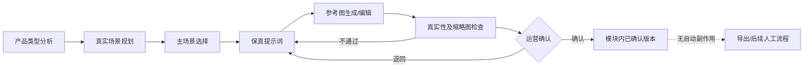

# MVP 商品图/场景图生成模块规格 V0.2

> 文档类型：阶段 0 开发契约  
> 状态：已确认范围，供原型、接口、数据模型和测试使用  
> 日期：2026-08-10  
> 适用阶段：MVP  

## 1. 决策与适用边界

本文件记录 V0.2 新增决定：把商品图/场景图生成与编辑纳入 MVP。它仅覆盖 V0.1 中“AI 自动生成或直接修改商品图片不进入 MVP”的旧范围结论；原交接包中的三角色、人工确认、高风险合规阻断、商品事实保护、禁止自动发布和 ERP 安全规则继续有效。

所有规范性要求均使用 `IMG-*` 编号。没有编号的说明文字只帮助理解，不替代验收条件。

| 需求编号 | 规范性要求 | MVP 验收条件 |
|---|---|---|
| IMG-SCOPE-001 | 商品图/场景图生成与基于参考图的编辑属于 MVP。 | MVP 页面清单、API 清单、数据模型和端到端测试中都能定位到该模块；系统不存在仅展示而无可执行能力的占位按钮。 |
| IMG-SCOPE-002 | MVP 生图必须遵循固定七阶段工作流，不提供绕过前序阶段的“直接生图”。 | 从 UI 和 API 分别尝试跳过任一前序阶段，均收到稳定业务错误且不创建下游候选图。 |
| IMG-SCOPE-003 | 没有合格产品参考图时，只能保存产品概念、场景规划和提示词草稿，不能生成或确认可交付商品图。 | 使用无参考图项目调用生成或确认接口，返回 `REFERENCE_IMAGE_REQUIRED`；项目仍可保存前三阶段草稿。 |
| IMG-SCOPE-004 | MVP 不包含批量无人值守生图、自动发布、真实 ERP 图片写回、自动最终化及其他图像模型。 | 验收环境中不存在这些外部副作用入口；请求任何非 `gpt-image-2` 模型均被拒绝。 |

## 2. 模块目标与闭环

模块帮助运营基于真实产品参考图，规划真实使用场景，生成或编辑保真候选图，并在真实性、缩略图和合规检查后进行人工确认。

| 需求编号 | 规范性要求 | MVP 验收条件 |
|---|---|---|
| IMG-WF-001 | 工作流顺序固定为：产品类型分析 → 真实场景规划 → 主场景选择 → 保真提示词 → 参考图生成/编辑 → 真实性及缩略图检查 → 运营确认。 | 一个端到端测试按顺序完成七阶段；每个阶段记录开始时间、结束时间、输入版本和输出版本。 |
| IMG-WF-002 | 任一上游输入变化都必须使受影响的下游结果失效，不得继续沿用旧检查结论。 | 修改商品事实、参考图、主场景或提示词后，既有下游结果被标记 `stale`，确认接口拒绝旧候选。 |
| IMG-WF-003 | 每次生成、编辑、检查和确认都必须形成独立记录，不原地覆盖历史。 | 对同一候选执行两次编辑后可查询三个版本及其父子关系，原始文件哈希不变。 |
| IMG-WF-004 | 工作流失败不覆盖最近一次成功版本，且给出可重试性和下一步操作。 | 注入超时与无效输出后，旧成功候选仍可查看；错误包含 `code`、`retryable`、`request_id` 和用户可执行建议。 |

## 3. 术语与事实来源

| 术语 | 定义 |
|---|---|
| 产品参考图 | 由运营明确选择、用于确认商品真实外观的图片；是生图模块的视觉事实源。 |
| 风格参考图 | 仅用于光线、色调、构图或氛围参考，不能覆盖产品事实。 |
| 竞品图 | 仅用于策略分析，不得作为本商品的产品参考图。 |
| 商品事实快照 | 发起工作流时保存的商品卡关键事实及其版本。 |
| 保真锁定项 | 生成和编辑时必须保持的几何、比例、材质、颜色、数量、Logo、文字及个性化内容。 |
| 候选图 | AI 生成或编辑的输出；初始永远不是最终版。 |
| 模块内已确认版本 | 由具有运营角色的用户显式确认的候选图；不等于已发布或已写回 ERP。 |

| 需求编号 | 规范性要求 | MVP 验收条件 |
|---|---|---|
| IMG-FACT-001 | 产品参考图是视觉事实源；商品卡是文字和结构化商品事实源。两者冲突时必须阻断并要求运营处理，系统不得自行猜测。 | 构造“商品卡颜色为黑色、参考图颜色为白色”的案例，系统产生冲突项且生成按钮不可用，直到运营更正或确认新的事实快照。 |
| IMG-FACT-002 | 产品参考图至少锁定：外形、结构、比例、材质、颜色、数量、Logo、可见文字/刻字和个性化内容；无法识别项标记为 `unknown`。 | 输入快照中存在上述九类字段；看不清的 Logo 测试图输出 `unknown`，不得生成猜测文本。 |
| IMG-FACT-003 | 风格参考图、竞品图和提示词均不能改写保真锁定项。 | 使用包含不同品牌、颜色和数量的风格/竞品图生成时，提示词锁定段仍来自产品参考图，冲突元素进入负向约束。 |
| IMG-FACT-004 | 每次任务保存产品参考图 ID、文件哈希、商品事实快照 ID、主场景版本和 Prompt 版本。 | 从任一候选图可反查全部五项，替换参考图后旧哈希仍保留在历史记录中。 |
| IMG-FACT-005 | 美工不能创建、修改、确认或覆盖商品事实；其反馈只能作为建议或新素材版本。 | 使用仅美工角色调用商品事实写接口返回 `403 PRODUCT_FACT_WRITE_FORBIDDEN`，数据库事实版本不变化并产生拒绝审计事件。 |

## 4. 七阶段功能规格

### 4.1 产品类型分析

结构化输出至少包含：`product_type`、`category_candidates`、`physical_form`、`intended_use`、`locked_traits`、`unknowns`、`fact_conflicts`、`source_asset_ids` 和 `source_snapshot_id`。

| 需求编号 | 规范性要求 | MVP 验收条件 |
|---|---|---|
| IMG-WF-101 | 系统基于商品事实快照和运营选定的产品参考图输出产品类型分析，不从通用审美模板直接开始。 | 固定 Mock 样例返回符合 Schema 的结构；缺少商品快照或参考图时阶段不能完成。 |
| IMG-WF-102 | 产品类型分析必须明确区分已确认事实、模型/Mock 判断、不确定项和事实冲突。 | 测试输出可按四类独立渲染；Schema 校验拒绝把 `unknown` 写入 `confirmed_facts`。 |
| IMG-WF-103 | 运营可以修正分类判断，但修正不能无痕改写商品事实。 | 修正产品类型会产生新分析版本；若涉及事实变化，必须另走商品卡编辑并产生新事实快照。 |

### 4.2 真实场景规划

每个场景候选至少包含：`scene_id`、`real_use_case`、`environment`、`user_context`、`product_placement`、`props`、`lighting`、`camera`、`why_realistic`、`risk_notes` 和 `thumbnail_intent`。

| 需求编号 | 规范性要求 | MVP 验收条件 |
|---|---|---|
| IMG-WF-201 | 场景必须来自产品真实用途、使用环境和目标人群，不得用与产品用途冲突的纯装饰场景代替。 | 三个测试品类分别得到与商品事实一致的场景；注入用途冲突时产生阻断项而非自动采纳。 |
| IMG-WF-202 | MVP 每次输出 1–3 个可比较的场景候选，并解释真实性、展示目的和风险。 | Mock 返回 1、2、3 个候选均通过；0 个或超过 3 个候选触发 `MODEL_OUTPUT_INVALID`。 |
| IMG-WF-203 | 道具和人物只能帮助说明真实使用方式，不得遮挡、替代或抢占商品主体。 | 场景 Schema 含主体占比与遮挡约束；含“道具为主角”测试夹具被检查器标记为高严重度场景问题。 |

### 4.3 主场景选择

| 需求编号 | 规范性要求 | MVP 验收条件 |
|---|---|---|
| IMG-WF-301 | 只有运营可以把一个场景候选选为当前主场景；系统不得自动选择后直接进入生成。 | 无运营角色请求返回 403；场景规划完成后状态停在 `scene_plan_ready`，直到运营显式选择。 |
| IMG-WF-302 | 当前工作流只能有一个主场景；更换主场景会使 Prompt、候选图和检查结论失效。 | 选择第二个主场景后第一个取消当前标记，已有下游记录变为 `stale`。 |
| IMG-WF-303 | 主场景选择记录选择人、选择时间、理由和场景版本。 | 查询审计时间线能获得四项字段；理由为空时 API 返回字段校验错误。 |

### 4.4 保真提示词

提示词对象至少包含：`scene_instruction`、`product_lock`、`composition`、`lighting`、`camera`、`allowed_context_changes`、`negative_constraints`、`reference_asset_ids`、`fact_snapshot_id` 和 `version`。

| 需求编号 | 规范性要求 | MVP 验收条件 |
|---|---|---|
| IMG-WF-401 | Prompt 必须由主场景与事实快照生成，并包含独立的保真锁定段和负向约束段。 | 固定样例中两段均非空，且锁定项逐项引用到事实或参考图来源。 |
| IMG-WF-402 | Prompt 不得新增无依据的材质、功能、认证、Logo、文字、数量或个性化内容。 | 向场景说明注入无依据认证词时，Prompt 构建失败并生成事实冲突，不调用图像 Provider。 |
| IMG-WF-403 | 人工编辑 Prompt 会创建新版本并重新执行事实一致性和合规检查。 | 编辑一次后版本号递增；高风险词测试导致状态进入 `compliance_blocked`。 |

### 4.5 参考图生成/编辑

| 需求编号 | 规范性要求 | MVP 验收条件 |
|---|---|---|
| IMG-WF-501 | 生成与编辑都必须携带至少一张产品参考图；编辑还必须引用父候选图。 | 缺少参考图或编辑父图时分别返回稳定错误，且 Provider 调用计数保持为 0。 |
| IMG-WF-502 | 中转站图像调用只允许 `gpt-image-2`；文本推理与视觉分析在首版使用 Mock。 | Provider 契约测试断言实际图像请求模型恒为 `gpt-image-2`；文本/视觉测试无网络请求。 |
| IMG-WF-503 | 每次 Provider 成功只创建候选版本，不得设置 `is_final`、`operator_confirmed`、`published` 或 `erp_written_back`。 | 检查新候选默认字段均为 false；数据库与事件总线无发布或 ERP 写回事件。 |
| IMG-WF-504 | 重试使用幂等键；相同键不得生成重复任务、重复候选或重复计费记录。 | 对同一请求并发提交两次，最终只有一个 Provider 任务和一个候选记录。 |
| IMG-WF-505 | 候选图保存父版本、Provider 请求 ID、模型名、文件哈希、尺寸、格式和生成时间。 | 成功响应落库后上述字段均可查询且哈希与实际文件一致。 |

### 4.6 真实性及缩略图检查

真实性检查至少覆盖：外形、结构、比例、材质、颜色、数量、Logo、可见文字/刻字、个性化内容、真实使用方式、遮挡和物理合理性。缩略图检查使用固定 `160×160` 的 1:1 预览，至少检查主体可识别、主体未被关键裁切、主体未被道具压制和核心视觉信息可读。

| 需求编号 | 规范性要求 | MVP 验收条件 |
|---|---|---|
| IMG-WF-601 | 每个候选都必须产生结构化真实性检查，逐项给出 `pass`、`fail` 或 `unknown`、严重度、证据和建议。 | Schema 覆盖全部检查项；任一高严重度 `fail` 或关键项 `unknown` 时不能进入运营确认。 |
| IMG-WF-602 | 每个候选都必须生成 `160×160` 缩略图预览并产生结构化检查结果。 | 生成候选后存在可下载缩略图及其哈希；关键裁切失败夹具不能进入确认。 |
| IMG-WF-603 | 首版视觉判断由 Mock Provider 返回，但图片尺寸、文件格式、文件哈希和缩略图生成必须由确定性本地逻辑验证。 | 断网执行测试时 Mock 检查可重复；篡改文件后哈希校验失败并阻断确认。 |
| IMG-WF-604 | 检查失败后的修改或重生成必须产生新候选并重新检查，不能手工把失败项直接改成通过。 | QA 结果更新接口不允许业务用户改写；新候选有新的 QA 报告并保留旧失败报告。 |

### 4.7 运营确认

| 需求编号 | 规范性要求 | MVP 验收条件 |
|---|---|---|
| IMG-WF-701 | 只有运营角色可以显式确认一个已通过真实性、缩略图和合规门禁的当前候选。 | 美工和仅管理员角色均返回 403；运营对通过候选确认成功并产生审计事件。 |
| IMG-WF-702 | 存在未处理高风险合规项时，任何角色（包括管理员）都不能确认。 | 三种角色组合对高风险候选确认均返回 `HIGH_RISK_BLOCKED`，确认字段保持 false。 |
| IMG-WF-703 | 中风险必须处理或记录保留理由，低风险必须展示给运营；两者处理记录进入审计。 | 未处理的中风险阻断确认；填写理由并复检后可继续；低风险确认页可见且审计记录完整。 |
| IMG-WF-704 | 运营确认只产生模块内已确认版本，不自动发布、不自动最终化其他内容类型、不触发 ERP 写回。 | 确认后仅当前图像候选为 `operator_confirmed`；发布、ERP 和其他内容版本记录数量不变。 |
| IMG-WF-705 | 运营可以拒绝候选并填写原因，拒绝不会删除候选历史。 | 拒绝后候选可查询、不可重新确认，原因和操作人出现在时间线。 |

## 5. 核心数据对象

| 需求编号 | 数据对象及最低字段 | MVP 验收条件 |
|---|---|---|
| IMG-DATA-001 | `image_workflows`：`id`、`project_id`、`status`、`fact_snapshot_id`、`reference_set_version`、`current_scene_plan_version`、`current_prompt_version`、`created_by`、时间戳。 | 数据库约束保证一个工作流引用同一项目内的快照和素材；状态值只能来自状态机枚举。 |
| IMG-DATA-002 | `image_reference_sets`：产品参考图、风格参考图、竞品图的分组、顺序、用途、文件哈希和版本。 | 竞品图不能被标记为产品参考图；替换任何产品参考图会生成新集合版本。 |
| IMG-DATA-003 | `image_scene_plans` 与 `image_prompt_versions`：结构化输出、父版本、输入快照、创建来源和操作人。 | 修改不覆盖旧记录；从 Prompt 可反查主场景和事实快照。 |
| IMG-DATA-004 | `image_candidates`：父候选、Provider 元数据、文件与缩略图引用、哈希、确认/拒绝状态。 | 生成、编辑、拒绝、确认四类记录关系可通过集成测试重建完整版本树。 |
| IMG-DATA-005 | `image_quality_reports` 与 `image_compliance_reports`：候选版本、检查器版本、逐项结果、风险处理和时间戳。 | 报告只能引用一个不可变候选版本；候选文件哈希变化时报告自动失效。 |
| IMG-DATA-006 | `audit_events`：操作者、有效角色、动作、对象、前后状态、输入/输出版本、请求 ID、结果和时间。 | 对生成、编辑、检查、拒绝、确认及所有门禁拒绝逐项查询到审计事件。 |

## 6. MVP 页面与接口边界

| 需求编号 | 规范性要求 | MVP 验收条件 |
|---|---|---|
| IMG-UI-001 | 商品项目内新增“场景图生成”页签，按七阶段展示当前状态、输入、输出、风险和下一步。 | 运营进入项目后可见七阶段进度；美工只看到被分配任务所需内容；仅管理员不能看到确认按钮。 |
| IMG-UI-002 | 生成前必须展示将发送的产品参考图、事实快照、场景和 Prompt 版本。 | 用户可在确认调用前逐项核对；版本缺失时按钮禁用且给出可行动提示。 |
| IMG-UI-003 | 候选详情必须并列展示产品参考图、候选图、真实性报告、缩略图和合规报告。 | 验收人员无需切换页面即可核对五类内容；每项均显示版本或哈希摘要。 |
| IMG-API-001 | API 使用 `/api/v1`，并分别提供工作流、参考集、场景、Prompt、候选、检查和确认资源。 | OpenAPI 中可搜索到七类资源；每个写接口声明请求 Schema、响应 Schema、错误码和权限。 |
| IMG-API-002 | 所有状态推进和确认由后端重新校验门禁，前端禁用按钮不作为安全边界。 | 绕过 UI 直接调用接口的负向测试全部被后端拒绝。 |

## 7. 端到端验收场景

| 测试编号 | 覆盖需求 | 场景与通过条件 |
|---|---|---|
| E2E-IMG-001 | IMG-WF-001、IMG-WF-101～IMG-WF-705 | 运营使用清晰产品参考图按七阶段走通；候选通过检查后由运营确认，所有版本与审计可追溯。 |
| E2E-IMG-002 | IMG-SCOPE-003、IMG-FACT-001 | 缺少参考图或参考图与商品事实冲突时，允许保存规划草稿，但生成与确认均被阻断。 |
| E2E-IMG-003 | IMG-WF-601～IMG-WF-604 | 候选出现数量错误或缩略图关键裁切，QA 失败；修改后形成新候选并重新检查，旧报告保留。 |
| E2E-IMG-004 | IMG-WF-701～IMG-WF-704、IMG-FACT-005 | 美工尝试改商品事实或确认、管理员尝试确认、高风险候选尝试确认，均被拒绝并留下审计记录。 |
| E2E-IMG-005 | IMG-WF-502～IMG-WF-504 | 文本/视觉 Mock 在断网环境可运行；图像中转站拒绝非 `gpt-image-2`；相同幂等键不产生重复候选。 |
| E2E-IMG-006 | IMG-WF-704、IMG-SCOPE-004 | 运营确认候选后，断言没有自动发布、自动 ERP 写回或其他内容类型自动最终化事件。 |

## 8. MVP 完成定义

| 需求编号 | 完成条件 | MVP 验收条件 |
|---|---|---|
| IMG-DOD-001 | 七阶段主流程、角色隔离、门禁、版本、审计和 Mock 测试全部可重复执行。 | `E2E-IMG-001` 至 `E2E-IMG-006` 全部通过并保存测试报告。 |
| IMG-DOD-002 | 真实图像中转站能力只能在具备安全配置时声明完成。 | 至少保存一次不含密钥的 `gpt-image-2` 请求/响应摘要、输出文件哈希和人工视觉验收记录；没有该证据时只能声明 Mock/契约完成。 |
| IMG-DOD-003 | 未完成能力不能用占位按钮或静态成功结果伪装。 | 验收扫描列出所有未实现入口；入口隐藏或明确标注不可用，且服务端返回稳定的未实现错误。 |
